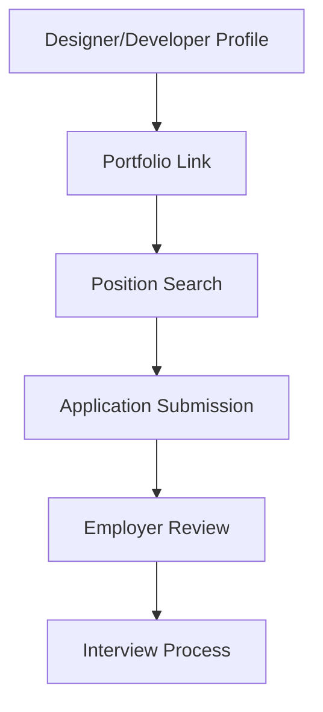

**Category:** Industry-Specific Job Boards
**Difficulty:** Intermediate
**Reading time:** 6 min read

---

Authentic Jobs is a job board dedicated to design and development positions with emphasis on quality employers and authentic work environments. It connects designers and developers with companies seeking creative and technical talent in web design, development, and related disciplines.

- **Quality Employer Curation** — emphasis on legitimate employers and quality job opportunities
- **Design and Development Focus** — positions in web design, UX/UI design, development, and creative technology
- **Portfolio Integration** — ability to include portfolio links in candidate profiles
- **Freelance and Full-Time Roles** — opportunities for both contract and permanent positions
- **Remote Work Options** — significant number of remote and location-independent positions

Designers and developers create profiles with portfolio links and project descriptions. The job board allows filtering by position type (design, front-end, back-end, full-stack), employment type (full-time, contract, freelance), and location (on-site, remote, hybrid). Employers post positions with detailed descriptions of team, project scope, and company culture. Application processes typically involve portfolio review and technical assessments. The platform curates employer listings to maintain quality and filter out low-quality positions. Premium features for employers include featured job placement and resume database access. Community features include design and development news, industry trends, and professional development resources.

- Web designers and UX designers seeking design-focused roles
- Frontend and fullstack developers finding development positions
- Creative technologists in AR/VR and emerging tech positions
- Freelance designers and developers finding project work
- Remote work opportunities for location-independent professionals

| Advantage | Disadvantage |
|-----------|--------------|
| Quality employer focus ensures legitimate opportunities | Smaller job volume than larger generalist platforms |
| Strong portfolio integration highlights creative work | Requires design/development background for most positions |
| Significant remote work options increase flexibility | Regional concentration in tech hubs |
| Direct employer contact streamlines communication | Salary data less transparent than some competitors |
| Design and development community engagement beneficial | May favor traditional design and development skills |

- [Behance Job Listings (Creative)](behance-job-listings-creative.md)
- [Dribbble Job Board (Design)](dribbble-job-board-design.md)
- [Developer Job Boards](../../index.md)

---
*Part of the [Industry-Specific Job Boards](index.md) category · [Back to Master Index](../../index.md)*
