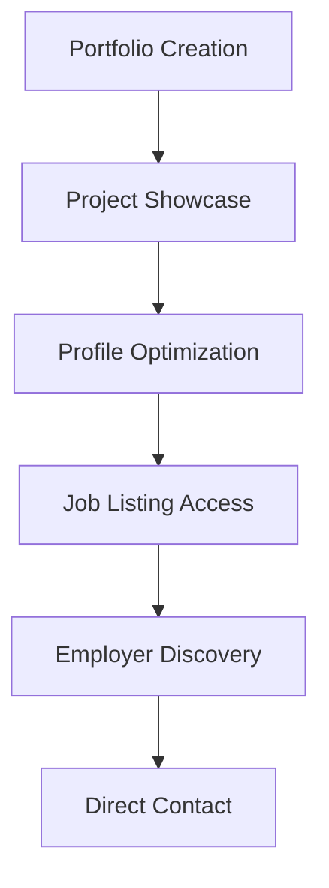

**Category:** Industry-Specific Job Boards
**Difficulty:** Intermediate
**Reading time:** 6 min read

---

Behance, owned by Adobe, is a creative portfolio platform that also features job listings for designers, artists, and creative professionals. It enables employers to browse creative work directly while connecting talent with job opportunities.

- **Integrated Portfolio Platform** — job listings connect directly to creative portfolios
- **Adobe Ecosystem Integration** — seamless connection with Creative Cloud tools
- **Creative Industry Focus** — positions for all design and creative disciplines
- **Employer Browse Capability** — companies can discover talent through portfolio browsing
- **Community Recognition** — featured projects and curated selections increase visibility

Creative professionals create Behance profiles and upload portfolio projects showcasing their work. Projects can be filtered by discipline, industry, and skill tags. Behance curates and features high-quality projects increasing visibility. Job listings appear alongside portfolio content, allowing employers to post positions and browse creative talent simultaneously. Employers can discover talent by browsing portfolio categories or searching specific skills. The platform facilitates direct messaging between creative professionals and employers. Integration with Adobe Creative Cloud streamlines workflow for design-focused roles. Community features including appreciation, follows, and recommendations build professional reputation.

- Graphic and visual designers showcasing commercial work
- UX/UI designers displaying digital product design portfolios
- Illustrators and artists seeking illustration and artwork contracts
- Motion graphics designers presenting video and animation work
- Creative directors and brand strategists building industry reputation

| Advantage | Disadvantage |
|-----------|--------------|
| Portfolio integration showcases work directly to employers | Behance curation standards may exclude some styles |
| Strong creative community with peer recognition | Adobe subscription may be required for best results |
| Seamless Creative Cloud integration for designers | Job volume lower than broader creative platforms |
| Employer discovery reduces need for active applications | Highly visual platform may disadvantage non-designers |
| Global reach connects international creative talent | Varies in quality and professionalism of listings |

- [Dribbble Job Board (Design)](dribbble-job-board-design.md)
- [Authentic Jobs Design/Dev](authentic-jobs-design-dev.md)
- [Creative Portfolio Platforms](../../index.md)

---
*Part of the [Industry-Specific Job Boards](index.md) category · [Back to Master Index](../../index.md)*
