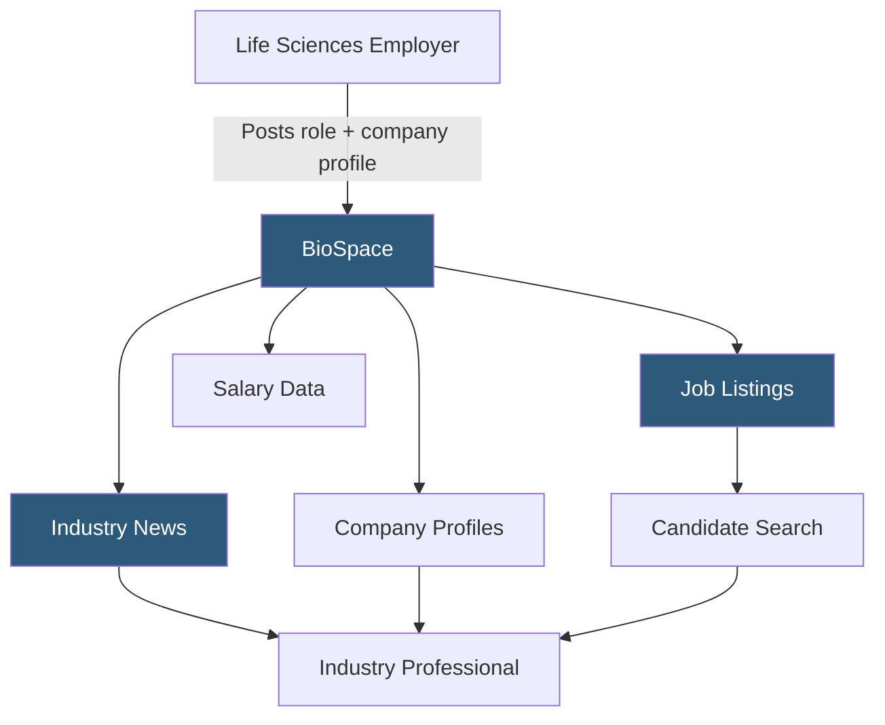

**Category:** Industry-Specific Job Boards
**Difficulty:** Beginner
**Reading time:** 5 min read

---

BioSpace is a leading life sciences industry hub combining a specialized job board with news, company profiles, and industry intelligence, serving biotechnology, pharmaceutical, medical device, and diagnostics professionals across research, development, commercial, and regulatory functions.

- **Biotech Hub** — a geographic cluster of biotechnology companies sharing talent pools and innovation infrastructure
- **Industry News Integration** — editorial content covering FDA approvals, clinical trial results, and M&A that contextualizes career decisions
- **Company Profile Page** — a detailed employer page where life sciences companies showcase pipeline, culture, and open roles
- **Hot Companies List** — BioSpace's curated rankings of high-growth, innovative life sciences employers attracting candidate attention
- **News-Driven Hiring Signals** — FDA approval announcements and clinical trial initiations signal imminent hiring surges
- **Salary Survey** — BioSpace's annual compensation benchmarking data for life sciences roles

BioSpace differentiates from pure job boards by building a life sciences information ecosystem around the career listings. Daily news coverage of FDA actions, clinical trial milestones, drug approvals, and company financings means that professionals visit BioSpace for industry intelligence even when not actively job searching — creating a large, engaged audience that employers can reach through both job listings and sponsored content.

The job listings are organized by functional area (research, clinical, regulatory, commercial, manufacturing) and by therapeutic area (oncology, immunology, rare disease, etc.), enabling precise matching between candidates' expertise and employer needs. Company profiles are a significant differentiator: candidates researching a biotech can view pipeline status, funding stage, recent news, and open roles in one place, supporting informed career decisions.

BioSpace's salary survey and compensation data, published annually, attract substantial traffic from professionals benchmarking their market value. This content positions BioSpace as an authoritative source for career intelligence beyond job listings. Employers advertise not just jobs but company visibility — sponsored company profiles and featured employer placement create brand awareness during periods when a company may be preparing to hire following a funding round or clinical milestone. The platform covers international life sciences hubs but is strongest in the U.S. market.

- Oncology drug discovery scientist tracking FDA news and monitoring career opportunities simultaneously
- Pharmaceutical company building employer brand awareness ahead of a major commercial launch hiring wave
- Life sciences professional comparing compensation data before negotiating a new role
- Clinical operations candidate researching CRO company culture before applying to multiple firms
- Biotech investor relations professional searching for communications roles at publicly traded biotechs

| Advantage | Disadvantage |
|-----------|--------------|
| News and industry intelligence drives engaged, returning audience | Premium employer branding features add significant cost |
| Company profiles allow in-depth employer research | Large pharma companies may have stronger brand via direct careers pages |
| Salary data supports informed compensation negotiation | Therapeutic area specificity may leave some roles underrepresented |
| Strong coverage of high-growth biotech companies | Less useful for non-U.S. life sciences markets |

- [Medzilla Biotech/Pharma Jobs](medzilla-biotechpharma-jobs.md)
- [Health eCareers Medical Jobs](health-ecareers-medical-jobs.md)
- [iHireVeterinary Veterinary Jobs](ihireveterinary-veterinary-jobs.md)

---
*Part of the [Industry-Specific Job Boards](index.md) category · [Back to Master Index](../../index.md)*
