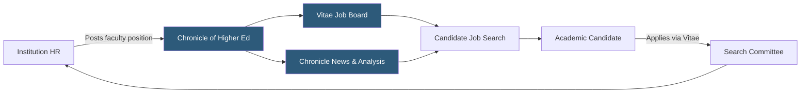

**Category:** Industry-Specific Job Boards
**Difficulty:** Beginner
**Reading time:** 5 min read

---

Chronicle Vitae is the career platform operated by The Chronicle of Higher Education, offering faculty and academic staff job listings integrated with the most widely read trade publication in higher education, giving candidates both job search and professional development resources.

- **Chronicle of Higher Education** — the premier news and analysis publication for higher education professionals, operated since 1966
- **Vitae Profile** — a public professional profile where academics showcase publications, research interests, and teaching philosophy
- **Academic CV** — a curriculum vitae tailored for academic hiring, distinct from a corporate resume in format and content expectations
- **Dossier Service** — a coordinated application packet service allowing candidates to send letters, CVs, and recommendations to search committees
- **Job Market Timing** — the seasonal patterns in academic hiring concentrated in fall and spring cycles
- **Adjunct / Contingent Faculty** — non-tenure-track positions that represent a growing share of academic teaching labor

Chronicle Vitae benefits directly from The Chronicle of Higher Education's editorial authority — academics who read the Chronicle for news on policy, funding, and institutional affairs encounter Vitae career listings in the same professional context. This integration creates an engaged audience that already trusts the Chronicle brand, rather than a platform built solely for transactional job searching.

Candidates create Vitae profiles that function as public academic portfolios. Profile sections include research interests, teaching areas, publications, conference presentations, and a short professional statement. These profiles allow passive discovery: hiring committees and department chairs can search Vitae to identify candidates whose research aligns with departmental needs before a formal search is even launched.

The job listings cover the full range of academic positions — tenured and tenure-track faculty, visiting and adjunct roles, postdocs, research scientist positions, and administrative roles. Search filters include discipline, degree required, institution type, and whether the position is tenure-eligible. The Chronicle's editorial content on surviving the academic job market, negotiating offers, and navigating academic career transitions adds practical value beyond the listing database, positioning Vitae as a career companion rather than just a job board.

- PhD candidate in English literature setting job market alerts for assistant professor openings
- Department chair searching Vitae profiles to identify strong candidates before posting a position
- University posting a visiting faculty position during a one-year leave replacement need
- Postdoc transitioning to industry searching for non-faculty research scientist roles
- Academic administrator following Chronicle news while monitoring leadership position openings

| Advantage | Disadvantage |
|-----------|--------------|
| Integration with Chronicle's trusted editorial brand | Subscription wall limits access to some Chronicle content |
| Public profile system supports passive candidate discovery | Competes directly with HigherEdJobs for the same audience |
| Strong coverage of humanities and social sciences | STEM listings sometimes more concentrated on HigherEdJobs |
| Career resources tailored to academic job market realities | Academic job market is highly competitive regardless of platform |

- [HigherEdJobs Academic Positions](higheredjobs-academic-positions.md)
- [AcademicKeys University Jobs](academickeys-university-jobs.md)
- [SchoolSpring K-12 Education](schoolspring-k-12-education.md)

---
*Part of the [Industry-Specific Job Boards](index.md) category · [Back to Master Index](../../index.md)*
