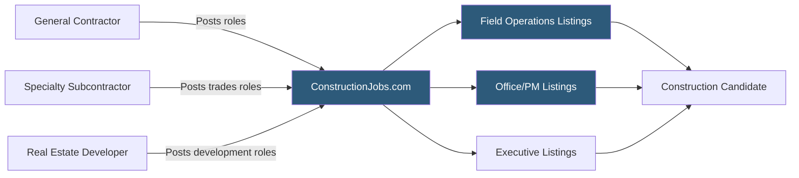

**Category:** Industry-Specific Job Boards
**Difficulty:** Beginner
**Reading time:** 5 min read

---

ConstructionJobs.com is a specialized job board for the construction, engineering, and trades industries, connecting general contractors, subcontractors, and specialty firms with project managers, superintendents, estimators, tradespeople, and construction executives.

- **General Contractor (GC)** — the primary contractor managing all aspects of a construction project and subcontractor coordination
- **Superintendent** — the on-site construction management professional responsible for daily field operations and schedule adherence
- **Estimator** — a construction professional who quantifies project costs and prepares competitive bids
- **Trade Contractor** — a specialty contractor performing specific work (electrical, plumbing, HVAC, concrete) under a GC
- **Project Manager** — the office-based coordinator managing budget, schedule, subcontracts, and owner communication
- **Construction Management Degree** — academic credentials from CM programs that construction employers specifically seek

ConstructionJobs.com aggregates listings from construction companies of all sizes — national ENR-ranked general contractors, regional builders, specialty subcontractors, and construction management firms. The platform categorizes roles across the project delivery spectrum: field roles (superintendent, foreman, craft workers), office roles (estimator, project engineer, project manager), executive roles (VP of Operations, Business Development), and support functions (safety, accounting, HR).

The construction industry is highly relationship-driven, but formal job boards play an increasing role as companies scale beyond word-of-mouth hiring capacity. ConstructionJobs.com's candidate database is used by construction recruiters who specialize in the sector, searching for project managers with specific project type experience (commercial, healthcare, multifamily, industrial) or project values (candidates who have managed $50M+ projects are distinct from those managing $10M projects).

Geographic coverage tracks construction activity — sunbelt markets, high-growth metros, and infrastructure project corridors are well represented. The platform's utility varies by market: in tight labor markets for skilled project managers, every sourcing channel is needed, while in saturated markets generalist boards may suffice. Construction employers often post the same role to multiple platforms simultaneously. The platform covers both union and non-union employment, with trade roles sometimes specifying union affiliation requirements.

- Commercial general contractor hiring a project superintendent with healthcare construction experience
- Electrical subcontractor searching for a licensed master electrician in a growth market
- Real estate developer recruiting a VP of Construction to oversee a multifamily development pipeline
- Construction management firm posting 10 project engineer openings for new hospital projects
- Safety director candidate searching for senior EHS management roles at top-tier GCs

| Advantage | Disadvantage |
|-----------|--------------|
| Construction-specific audience reduces irrelevant applications | Generalist boards like Indeed also capture significant construction traffic |
| Covers field through executive roles in one platform | Craft/trades listings compete with local union halls and direct referrals |
| Project type and value filtering supports precise sourcing | Geographic effectiveness varies by market activity level |
| Resume database supports proactive sourcing in tight talent markets | Less editorial content compared to engineering-focused platforms |

- [iHireConstruction Jobs](ihireconstruction-jobs.md)
- [Rigzone Oil and Gas Jobs](rigzone-oil-and-gas-jobs.md)
- [EngineerJobs.com](engineerjobscom.md)

---
*Part of the [Industry-Specific Job Boards](index.md) category · [Back to Master Index](../../index.md)*
