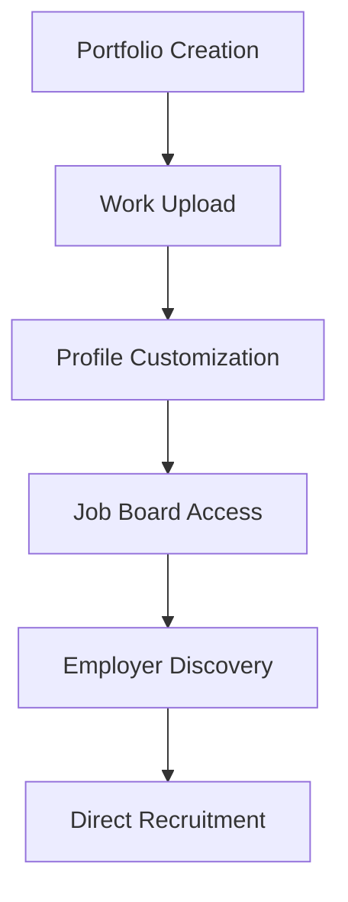

**Category:** Industry-Specific Job Boards
**Difficulty:** Intermediate
**Reading time:** 6 min read

---

Coroflot is a portfolio website and job board for graphic designers, industrial designers, illustrators, and other creative professionals. It enables creative professionals to showcase portfolios while providing job listings from design-focused employers.

- **Portfolio Website Hosting** — professional portfolio website for creative professionals
- **Design Job Listings** — positions for graphic design, industrial design, illustration, and related fields
- **Employer Portfolio Browsing** — companies can search designer portfolios by specialization
- **Professional Networking** — community features connecting designers and industry professionals
- **Design Education Content** — resources and articles supporting professional development

Designers create Coroflot portfolio websites with customizable templates and themes. Portfolio pages showcase design work with project descriptions and visual hierarchy. Designers maintain profiles with contact information and background. Job listings come from design-focused companies and agencies seeking specific design expertise. Employers can browse portfolios filtered by design discipline (graphic design, UX design, industrial design, illustration). The platform enables direct messaging between designers and recruiters. Portfolio statistics track viewer engagement and applications. Community forums and resource library support professional development and industry knowledge sharing.

- Graphic designers establishing professional portfolios and finding employment
- Industrial designers showcasing product design work
- Illustrators and digital artists presenting artwork
- UX/UI designers creating professional design portfolios
- Freelance designers finding contract and project-based work

| Advantage | Disadvantage |
|-----------|--------------|
| Professional portfolio hosting with design-focused templates | Smaller job volume than broader platforms |
| Designer community provides networking and support | Portfolio site customization options limited |
| Employer portfolio search streamlines discovery | Subject to changing design trends and styles |
| Established platform with long industry history | May feel outdated compared to newer platforms |
| Transparent portfolio showcase builds professional reputation | Quality of applications may include unsuitable candidates |

- [Krop Creative Jobs](krop-creative-jobs.md)
- [Behance Job Listings (Creative)](behance-job-listings-creative.md)
- [Design Portfolios](../../index.md)

---
*Part of the [Industry-Specific Job Boards](index.md) category · [Back to Master Index](../../index.md)*
