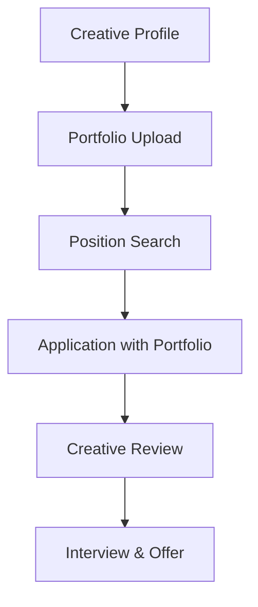

**Category:** Industry-Specific Job Boards
**Difficulty:** Intermediate
**Reading time:** 6 min read

---

CreativeHotlist is a job board dedicated to creative professionals including designers, art directors, copywriters, and other creative roles. It connects creative talent with advertising agencies, design studios, and creative departments across industries.

- **Portfolio-Driven Hiring** — emphasis on visual samples and creative work
- **Creative Role Specialization** — positions for designers, art directors, UX designers, creative directors
- **Agency and In-House Roles** — opportunities at creative agencies and corporate creative departments
- **Skill-Based Filtering** — search by design discipline, software proficiency, and industry
- **Creative Community** — networking and showcase opportunities for creative professionals

Creative professionals build profiles showcasing their work through portfolio links and embedded samples. The search interface filters positions by creative discipline (graphic design, UX design, art direction, copywriting), industry, location, and experience level. Job listings come from creative agencies, corporate marketing departments, and design studios. Applications include links to full portfolios demonstrating creative capabilities. Hiring managers review portfolios to assess design aesthetic, technical skill, and creative thinking. The platform hosts creative showcases and community features fostering professional connections. Industry events and workshops support professional development within the creative community.

- Graphic designers seeking agency and in-house positions
- UX/UI designers finding digital product design roles
- Art directors and creative directors for advertising campaigns
- Copywriters and content creators in marketing roles
- Motion graphics and video designers for multimedia projects

| Advantage | Disadvantage |
|-----------|--------------|
| Portfolio emphasis provides transparent skill assessment | Portfolio development requires significant time investment |
| Specialized audience attracts serious creative talent | Subjective aesthetic evaluation can disadvantage some candidates |
| Community features build professional networks | Geographic concentration in major creative markets |
| Direct employer contact streamlines hiring | Highly competitive field with many qualified candidates |
| Industry-specific tools streamline job search | May overvalue portfolio over professional experience |

- [Behance Job Listings (Creative)](behance-job-listings-creative.md)
- [Dribbble Job Board (Design)](dribbble-job-board-design.md)
- [Creative Careers](../../index.md)

---
*Part of the [Industry-Specific Job Boards](index.md) category · [Back to Master Index](../../index.md)*
