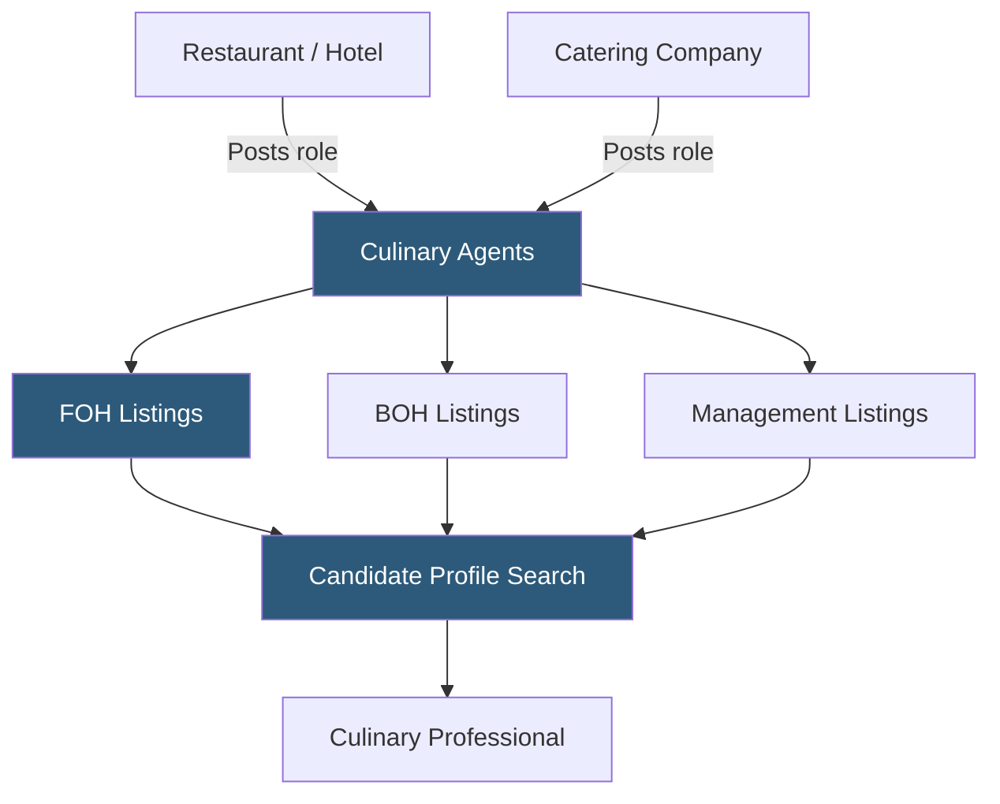

**Category:** Industry-Specific Job Boards
**Difficulty:** Beginner
**Reading time:** 5 min read

---

Culinary Agents is a specialized job and networking platform for the food and beverage industry, connecting chefs, servers, bartenders, sommeliers, restaurant managers, and culinary professionals with restaurants, hotels, catering companies, and food businesses.

- **Front of House (FOH)** — guest-facing restaurant roles: servers, bartenders, hosts, and floor managers
- **Back of House (BOH)** — kitchen roles: line cooks, sous chefs, pastry chefs, and prep staff
- **Executive Chef** — the senior culinary leadership role responsible for menu development and kitchen operations
- **Sommelier / Beverage Director** — a wine and beverage specialist managing wine programs and staff training
- **Private Dining / Events** — catering, private chef, and event hospitality roles outside traditional restaurant settings
- **Culinary Portfolio** — a candidate's documented work history including notable restaurants, chefs worked under, and menu contributions

Culinary Agents functions as a combination professional network and job board, more analogous to LinkedIn for culinary professionals than a traditional listing aggregator. Candidates build detailed profiles that document their culinary career: restaurants worked at, positions held, notable chefs and restaurant groups they've been associated with, culinary school credentials, and specializations (pastry, Mediterranean cuisine, bar programs, etc.).

The professional network aspect is important in the culinary industry, where reputation and word-of-mouth referrals are primary hiring channels. Culinary Agents attempts to formalize this network by connecting chefs with their professional contacts and making culinary credentials discoverable to operators. Chefs who worked at well-regarded restaurants gain visibility simply from having that association in their profile.

Employers search the candidate database by cuisine type, role, experience level, and geography. The restaurant industry's chronic staffing challenges mean operators are rarely willing to wait for inbound applications — the proactive sourcing model suits their hiring urgency. Culinary Agents covers both high-end fine dining and casual dining, though fine dining operators find the platform particularly valuable for sourcing experienced talent with high-profile culinary backgrounds. The platform also lists private chef roles, supper club concepts, food media positions, and recipe development jobs that broader boards would not capture.

- Michelin-starred restaurant finding a pastry chef with French pastry training and fine dining experience
- Hotel F&B director sourcing a sommelier with Court of Master Sommeliers credentials
- Fast-casual restaurant chain hiring 15 kitchen managers across a regional expansion
- Private household seeking a private chef with Mediterranean cuisine expertise
- Food media company recruiting a recipe developer and food stylist

| Advantage | Disadvantage |
|-----------|--------------|
| Professional network model suits reputation-driven culinary hiring | Effectiveness varies by city market — strongest in major food cities |
| Covers both FOH and BOH in one platform | Not useful for non-culinary hospitality roles |
| Fine dining and high-end operators well represented | Less useful for fast food or QSR operations |
| Private chef and non-restaurant food roles included | High turnover in industry means frequent profile maintenance needed |

- [Hcareers Hospitality Careers](hcareers-hospitality-careers.md)
- [Hospitality Online Hotel Jobs](hospitality-online-hotel-jobs.md)
- [Snagajob Hourly Worker Platform](snagajob-hourly-worker-platform.md)

---
*Part of the [Industry-Specific Job Boards](index.md) category · [Back to Master Index](../../index.md)*
