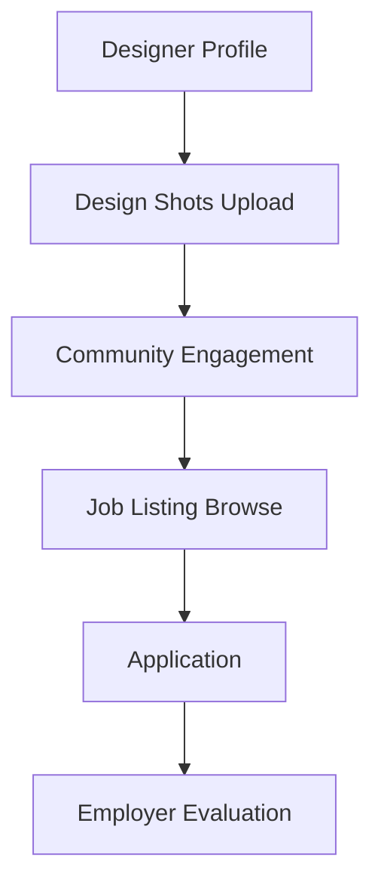

**Category:** Industry-Specific Job Boards
**Difficulty:** Intermediate
**Reading time:** 6 min read

---

Dribbble is a creative community platform for designers featuring a job board for design positions. It connects designers with employers seeking design talent while serving as a visual showcase for design work and trending design trends.

- **Visual-First Approach** — design-centered platform emphasizing visual work over text
- **Design Community** — interaction and feedback from fellow designers on work
- **Job Board Integration** — positions posted alongside design showcase content
- **Trending Design Showcases** — curated collections of design work and visual trends
- **Designer Reputation** — professional recognition based on community engagement and likes

Designers build Dribbble profiles and upload "shots" (design work samples) including website design, app interfaces, branding, and illustrations. Community members provide feedback and appreciation through likes and comments. Trending algorithms surface high-quality and novel design work. Job listings are posted by companies seeking designers and include links to application processes. Employers can browse designer portfolios and trending work to identify candidate styles. The platform facilitates direct messaging for recruitment inquiries. Design trends and community curation showcase emerging design patterns and inspiration. Annual events and meetups foster the designer community globally.

- UI/UX designers showcasing interface and interaction design
- Web designers displaying website design portfolios
- Visual and graphic designers presenting brand and identity work
- Illustrators and digital artists sharing artwork
- Branding and design system specialists

| Advantage | Disadvantage |
|-----------|--------------|
| Strong design community provides peer feedback and inspiration | Visual-first focus may disadvantage non-visual designers |
| Trending algorithms increase portfolio visibility | Highly competitive platform with many talented designers |
| Direct employer outreach based on portfolio quality | Limited job listings compared to job boards |
| Global community expands networking reach | Subjective design appreciation may not match market needs |
| Community engagement builds professional reputation | Quality of job postings varies by employer |

- [Behance Job Listings (Creative)](behance-job-listings-creative.md)
- [Authentic Jobs Design/Dev](authentic-jobs-design-dev.md)
- [Design Portfolios](../../index.md)

---
*Part of the [Industry-Specific Job Boards](index.md) category · [Back to Master Index](../../index.md)*
