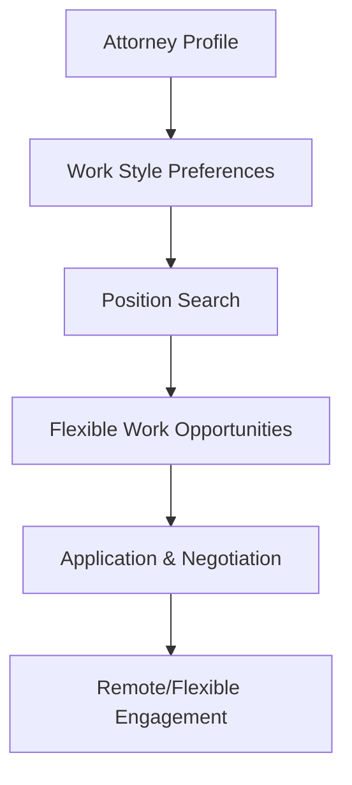

**Category:** Industry-Specific Job Boards
**Difficulty:** Intermediate
**Reading time:** 6 min read

---

eAttorney is a niche job board specializing in attorney and legal professional positions with emphasis on remote work and flexible arrangements. It caters to legal professionals seeking alternative work arrangements beyond traditional law firm structures.

- **Remote Legal Roles** — attorney positions and legal services available from any location
- **Flexible Scheduling** — part-time and contract-based legal work arrangements
- **Solo Practice Support** — resources for attorneys starting independent practice
- **Legal Technology Integration** — roles combining legal expertise with tech skills
- **Alternative Legal Services** — non-traditional legal service delivery models

Attorneys create profiles specifying their practice areas, experience level, and preferred work arrangements (remote, flexible, contract, part-time). The search interface filters positions by work style and arrangement type. Job listings come from law firms offering remote positions, corporate legal departments, and alternative legal service providers. The platform emphasizes positions accommodating lawyer lifestyles and non-traditional arrangements. Networking resources connect attorneys with peers and mentors in alternative practice settings. Professional development content addresses remote practice management and technology requirements. Resources support attorneys transitioning from traditional law firms to independent or flexible arrangements.

- In-house counsel seeking remote positions with multinational corporations
- Contract attorneys providing specialized legal services to multiple clients
- Part-time legal positions for attorneys balancing other commitments
- Solo practitioners finding remote paralegal and support staff
- Legal technology roles combining attorney skills with programming

| Advantage | Disadvantage |
|-----------|--------------|
| Focuses on flexible and remote legal work arrangements | Smaller job volume than traditional legal boards |
| Appeals to attorneys seeking work-life balance | Quality and legitimacy varies in alternative legal models |
| Lower geographic barriers for remote positions | Income stability may be less predictable |
| Lower overhead supports competitively lower rates | Professional development opportunities may be limited |
| Enables geographic flexibility for candidate relocation | Networking and mentorship less structured than firms |

- [Legal Staff Legal Support Jobs](legal-staff-legal-support-jobs.md)
- [Remote Work Opportunities](../../index.md)
- [Legal Careers](../../index.md)

---
*Part of the [Industry-Specific Job Boards](index.md) category · [Back to Master Index](../../index.md)*
