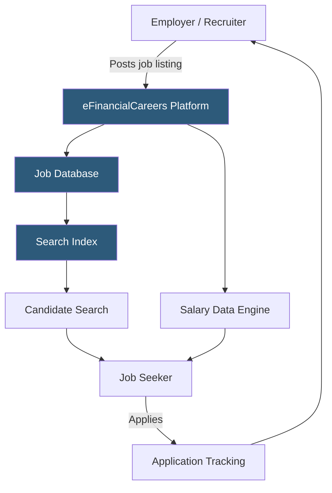

**Category:** Industry-Specific Job Boards
**Difficulty:** Beginner
**Reading time:** 5 min read

---

eFinancialCareers is a specialized job board dedicated exclusively to financial services roles, connecting professionals in banking, investment management, trading, and fintech with employers worldwide. It operates across major financial hubs including New York, London, Hong Kong, and Singapore.

- **Job Board Aggregator** — a platform that collects listings from multiple financial employers into a single searchable database
- **Candidate Profile** — a professional record including work history, skills, and compensation expectations visible to recruiters
- **Recruiter Access** — subscription tiers allowing headhunters and internal HR to search candidate databases
- **Salary Benchmarking** — eFinancialCareers' proprietary data showing compensation ranges by role, location, and seniority
- **Industry Vertical** — a job board focused on one specific sector rather than all professions
- **Resume Alerts** — automated notifications sent when new roles match a candidate's saved criteria

eFinancialCareers operates as a two-sided marketplace connecting financial employers with candidates. Employers purchase posting credits or subscription packages that allow them to list open roles with detailed descriptions, compensation ranges, and required qualifications. Listings are ingested into a search index that candidates query using filters for role type (front office, middle office, back office), seniority, location, and sector (investment banking, asset management, hedge funds, fintech).

Candidates create profiles that serve dual purposes: applying to posted roles and surfacing in recruiter searches. The recruiter database search is a core product, allowing headhunters to proactively source talent by filtering on skills, educational background, experience, and current compensation. Candidate visibility is configurable — professionals can remain anonymous until they engage with an inquiry.

The platform also provides editorial content including salary surveys, market trend reports, and career advice articles, which drive organic search traffic and keep candidates returning between active job searches. Email alert subscriptions notify both candidates and recruiters of new matches, reducing the need for daily manual searches. eFinancialCareers integrates with many Applicant Tracking Systems (ATS) via API, allowing employers to route applications directly into their hiring pipelines.

- Investment banking analyst searching for associate-level lateral moves
- Hedge fund recruiter sourcing quant developers with Python and C++ skills
- Asset management firm posting multiple portfolio manager openings simultaneously
- Financial services professional benchmarking their compensation against market rates
- Fintech startup advertising engineering and product roles to finance-literate candidates

| Advantage | Disadvantage |
|-----------|--------------|
| Deep financial sector specialization | Limited reach outside financial services |
| Global coverage across major financial hubs | Higher posting costs than generalist boards |
| Recruiter database search for proactive sourcing | Smaller candidate pool than LinkedIn or Indeed |
| Salary benchmarking data included | Some listings may be stale or from agencies reposting |

- [Mediabistro Media Jobs](mediabistro-media-jobs.md)
- [Idealist Nonprofit Jobs](idealist-nonprofit-jobs.md)
- [LawCrossing Legal Jobs](lawcrossing-legal-jobs.md)

---
*Part of the [Industry-Specific Job Boards](index.md) category · [Back to Master Index](../../index.md)*
