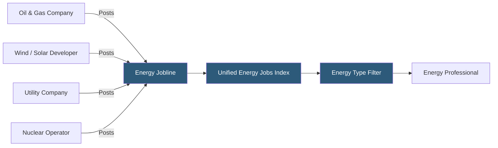

**Category:** Industry-Specific Job Boards
**Difficulty:** Intermediate
**Reading time:** 5 min read

---

Energy Jobline is a global job board serving the energy sector including oil and gas, renewables, power generation, utilities, and nuclear, connecting engineers, project developers, and energy sector professionals with employers worldwide.

- **Renewables Transition** — the energy sector shift from fossil fuels toward wind, solar, and storage technologies, creating new role categories
- **Wind Energy Roles** — turbine technicians, wind project developers, and resource assessment engineers
- **Solar PV Roles** — installation contractors, project finance specialists, and grid interconnection engineers
- **Utility / Power Generation** — roles at electric utilities, independent power producers, and grid operators
- **Nuclear Energy** — licensed nuclear operators, health physicists, and reactor engineers requiring specialized certifications
- **Energy Transition** — a platform differentiator — Energy Jobline covers both legacy fossil fuel and emerging clean energy roles

Energy Jobline differentiates from Rigzone by explicitly covering the full energy spectrum, not just oil and gas. As the energy transition accelerates, professionals from oil and gas are increasingly moving into renewable energy roles — offshore wind platform operations, for instance, draws heavily from offshore oil and gas expertise. Energy Jobline's cross-sector coverage makes it useful for candidates navigating this transition as well as employers in emerging clean energy sectors.

The platform's global reach is genuine — with operations covering the U.S., UK, Europe, Middle East, and Asia Pacific, it reflects the international nature of energy project development. Large offshore wind projects in the North Sea, solar parks in Spain, and LNG terminals in Qatar all have staffing needs that cross national talent markets. Energy Jobline captures this international dimension better than many national boards.

Role categories span project development, engineering (civil, electrical, mechanical), HSE, project management, commercial/contracts, finance, and field operations. The platform also covers energy sector-specific functions like power trading, grid operations, and energy storage system integration that are invisible on generalist boards. Employers post directly or use Energy Jobline's database access for proactive sourcing. The platform's news section covers energy policy, project awards, and market developments that attract professionals keeping pace with an industry undergoing structural transformation.

- Offshore wind developer hiring project managers with offshore construction background
- Oil and gas company recruiting a VP of Sustainability to lead its energy transition strategy
- Solar EPC contractor staffing a 500MW utility-scale project with engineers and construction supervisors
- Energy storage company sourcing grid integration engineers with battery systems expertise
- Nuclear facility operator recruiting licensed reactor operators for a plant life extension program

| Advantage | Disadvantage |
|-----------|--------------|
| Covers both legacy and clean energy — supports career transitions | Less deep than Rigzone for oil and gas specifically |
| Genuine global coverage matches international energy project activity | Renewables roles also heavily posted on LinkedIn and specialist renewables boards |
| Energy transition coverage positions it well for long-term sector growth | Field technician roles compete with trade union hiring channels |
| Cross-sector candidate discovery supports energy transition movement | Brand recognition varies significantly by geographic market |

- [Rigzone Oil and Gas Jobs](rigzone-oil-and-gas-jobs.md)
- [EngineerJobs.com](engineerjobscom.md)
- [iHireEngineering Jobs](ihireengineering-jobs.md)

---
*Part of the [Industry-Specific Job Boards](index.md) category · [Back to Master Index](../../index.md)*
