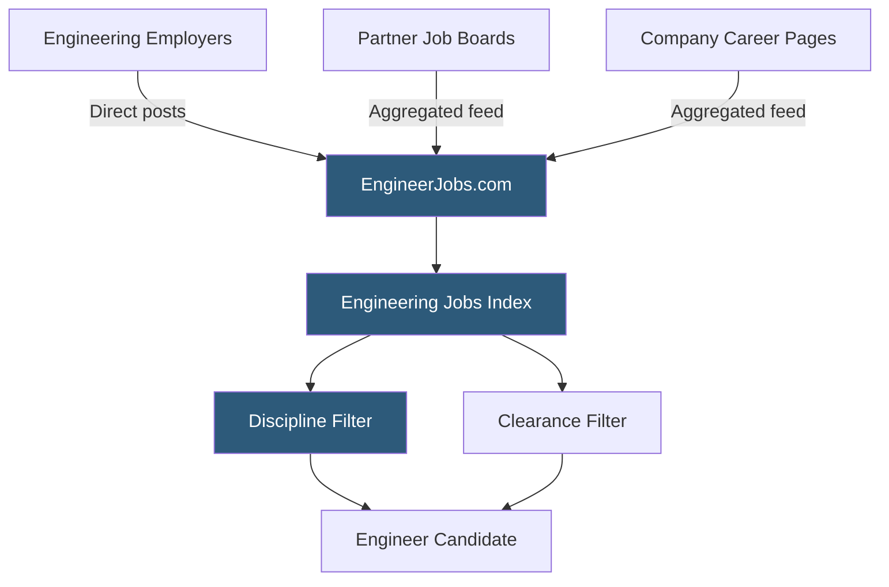

**Category:** Industry-Specific Job Boards
**Difficulty:** Beginner
**Reading time:** 5 min read

---

EngineerJobs.com is a specialized job board aggregating engineering roles across all major disciplines — mechanical, electrical, civil, chemical, software, aerospace, and industrial — serving both engineering professionals and employers seeking technical talent.

- **Engineering Discipline** — the specific branch of engineering (mechanical, electrical, civil, etc.) defining a candidate's technical training
- **Professional Engineer (PE) License** — a state-issued credential required for engineering work affecting public safety, particularly in civil and structural engineering
- **Engineering Job Aggregation** — pulling listings from company career pages, partner boards, and direct postings into one searchable index
- **Defense / Government Engineering** — engineering roles requiring security clearances — a significant subset of the engineering job market
- **Clearance Required** — notation indicating a role requires an active U.S. government security clearance (Secret, TS, TS/SCI)
- **Contract Engineering** — project-based or temporary engineering assignments, common in manufacturing, defense, and aerospace

EngineerJobs.com aggregates engineering roles from a wide variety of sources including company career pages, staffing agencies, and partner job boards, supplemented by direct employer postings. The aggregation model maximizes listing volume, which is critical in a field where candidates evaluate opportunities across many employers simultaneously.

The platform's core value is discipline-based filtering. An electrical power engineer and a software engineer are both "engineers" but their roles are non-overlapping. EngineerJobs.com's discipline taxonomy allows candidates to filter precisely, eliminating irrelevant listings from a potentially enormous dataset. Secondary filters include required experience level, location, and whether a security clearance is required — a particularly important filter for defense and government contracting roles.

Engineering hiring has two distinct segments: commercial/industrial roles where the hiring cycle resembles standard corporate recruiting, and government/defense roles that require clearance verification and often involve contractor-to-hire or direct government employment pathways. EngineerJobs.com serves both segments, though cleared engineering roles are particularly well-represented given the concentration of defense contractors in the platform's U.S. coverage area.

Staffing agencies post high volumes of contract engineering listings, reflecting the project-based nature of engineering work in industries like automotive, aerospace, and energy. Contract engineering allows companies to scale technical capacity for specific programs without permanent headcount additions.

- Mechanical design engineer searching for product development roles in the medical device sector
- Aerospace company posting a structural analysis engineer opening requiring active Secret clearance
- Civil engineering consultant searching for licensed PE roles in transportation infrastructure
- Industrial engineering graduate filtering entry-level manufacturing engineer openings by discipline
- Defense contractor staffing 50 electrical engineers for a multi-year government programs contract

| Advantage | Disadvantage |
|-----------|--------------|
| Cross-discipline coverage serves all engineering fields in one place | Aggregated listings may be stale or already filled |
| Security clearance filter is a unique differentiator | Software engineering roles better served by tech-specific boards |
| Strong defense/government contractor coverage | PE licensing requirements vary by state — platform cannot verify |
| Contract and direct hire listings serve both hiring models | Less editorial content than discipline-specific engineering societies |

- [IEEE Job Site Engineering](ieee-job-site-engineering.md)
- [iHireEngineering Jobs](ihireengineering-jobs.md)
- [Rigzone Oil and Gas Jobs](rigzone-oil-and-gas-jobs.md)

---
*Part of the [Industry-Specific Job Boards](index.md) category · [Back to Master Index](../../index.md)*
