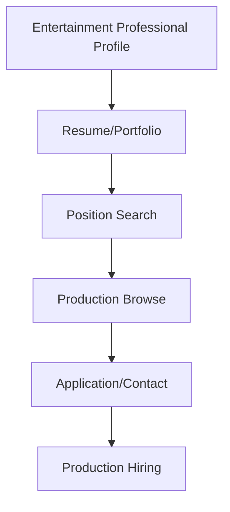

**Category:** Industry-Specific Job Boards
**Difficulty:** Intermediate
**Reading time:** 6 min read

---

Entertainment Careers is a job board dedicated to film, television, and entertainment industry positions. It connects entertainment professionals with studios, production companies, streaming platforms, and related organizations seeking talent.

- **Production and Below-the-Line Roles** — positions for crew, technicians, and production staff
- **Above-the-Line Positions** — directors, writers, producers, and creative leadership roles
- **Studio and Executive Roles** — business, legal, and development positions in entertainment companies
- **Freelance and Contract Work** — project-based and contract positions common in film and television
- **Streaming and Digital Media** — growing opportunities in streaming platforms and digital content

Entertainment professionals create profiles highlighting relevant experience, credits, and union affiliations (SAG-AFTRA, DGA, WGA, etc.). The job board searches across production opportunities, studio positions, and streaming roles. Job listings come from production companies, studios, and streaming platforms. The platform allows filtering by position type (crew positions, creative roles, executive positions), production type (film, television, digital), and location. Direct messaging connects candidates with producers and production managers. Union and guild information supports compliance and professional development. Industry news and production announcements keep professionals informed of upcoming opportunities. Career resources include contract negotiation guides and professional development information.

- Film and television crew positions (cinematography, sound, lighting, production design)
- Producers and associate producers for film and television projects
- Writers and development professionals at studios and production companies
- Production management and logistics positions
- Post-production specialists (editing, color correction, sound design)

| Advantage | Disadvantage |
|-----------|--------------|
| Comprehensive entertainment industry coverage | Highly competitive field with many applicants |
| Union and guild support for professional standards | Inconsistent employment patterns and contract work |
| Streaming growth creates emerging opportunities | Geographic concentration in entertainment hubs |
| Direct production contact streamlines hiring | Below-the-line positions often lower compensation |
| Portfolio and credit showcase builds reputation | Career advancement heavily dependent on networking |

- [ProductionHUB Film/Video Jobs](productionhub-film-video-jobs.md)
- [Mandy.com Film Crew Jobs](mandycom-film-crew-jobs.md)
- [Film and Television Careers](../../index.md)

---
*Part of the [Industry-Specific Job Boards](index.md) category · [Back to Master Index](../../index.md)*
