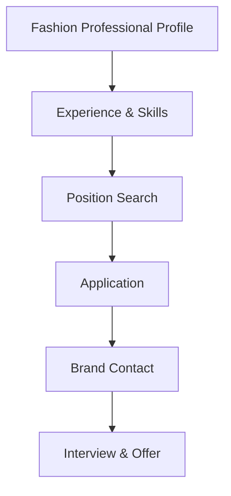

**Category:** Industry-Specific Job Boards
**Difficulty:** Intermediate
**Reading time:** 6 min read

---

Fashion Jobs is a specialized job board dedicated to the fashion and apparel industry. It connects fashion professionals with retail, design, merchandising, and corporate positions across fashion companies and brands.

- **Fashion Industry Focus** — positions in design, merchandising, retail, product development, and management
- **Brand Database** — searchable directory of fashion companies and retailers
- **International Opportunities** — global fashion market with positions in multiple countries
- **Career Path Guidance** — resources helping professionals navigate fashion industry careers
- **Trend and Market Insights** — industry news and market analysis for career planning

Fashion professionals create profiles with relevant experience, design skills, and career interests. The job board filters positions by role (designer, merchandiser, retail manager, product development), brand, and location. Job listings come from fashion brands, retailers, and design studios seeking fashion talent. Applications go directly to employers or recruiting partners. The platform provides fashion industry databases enabling research of target employers. Career resources include industry insights, salary benchmarks, and professional development guidance. Community features connect fashion professionals for networking and mentorship. Fashion news and trend reporting keep professionals current on industry developments.

- Fashion designers seeking design positions with brands and design studios
- Merchandise planners and buyers finding retail positions
- Retail management and store operations roles
- Product development and quality assurance positions
- Fashion marketing, branding, and business development roles

| Advantage | Disadvantage |
|-----------|--------------|
| Specialized platform attracts serious fashion industry talent | Limited to fashion industry decreasing job volume |
| International reach spans global fashion markets | Salary competitiveness varies significantly by region |
| Brand database enables targeted job search | Geographic concentration in major fashion hubs |
| Industry insights support career planning | Fast-changing trends may quickly date guidance |
| Career resources specific to fashion industry | Requires fashion industry background for best results |

- [FashionCareerCenter.com](fashioncareercentercom.md)
- [Retail Careers](../../index.md)
- [Fashion Industry](../../index.md)

---
*Part of the [Industry-Specific Job Boards](index.md) category · [Back to Master Index](../../index.md)*
