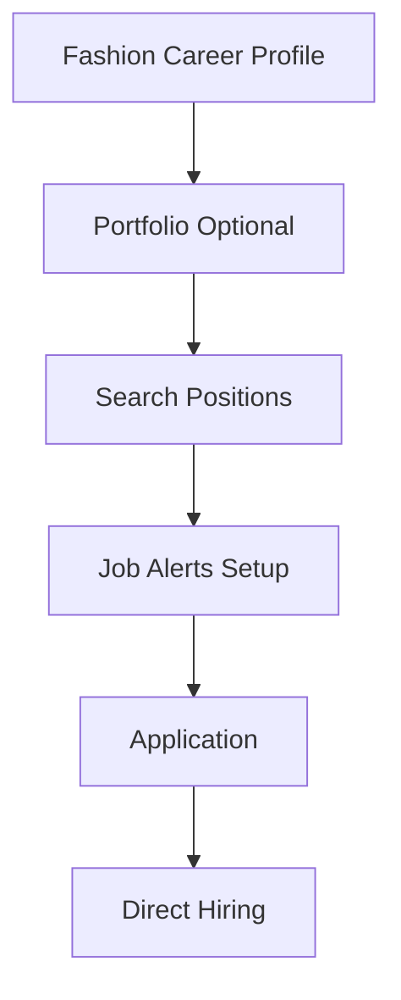

**Category:** Industry-Specific Job Boards
**Difficulty:** Intermediate
**Reading time:** 6 min read

---

FashionCareerCenter.com is a specialized job portal for fashion industry careers offering positions in design, retail, merchandising, and fashion business roles. It provides targeted job listings and career resources for fashion professionals.

- **Fashion Role Specialization** — positions across design, merchandising, retail, and management
- **Salary Transparency** — published salary ranges helping candidates understand compensation
- **Career Guidance** — resources for fashion career planning and advancement
- **Resume and Portfolio Showcase** — ability to highlight work and design portfolios
- **Job Alert System** — automated notifications of positions matching saved criteria

Fashion professionals create profiles highlighting experience, specialization, and career goals. The platform allows portfolio or design sample uploads for design-focused roles. Job board search filters by role type, company, location, and salary range. Automated job alerts notify subscribers of new matching positions. Resume management enables profile optimization for specific applications. The platform publishes salary data providing transparent compensation benchmarks. Career resources including interview guides and negotiation tips support job search success. Direct employer contact streamlines communication. Mobile app enables job search and applications on-the-go.

- Fashion designers finding design positions
- Buyers and merchandisers seeking merchandising and planning roles
- Retail management and store operations
- Fashion marketing and brand management positions
- Product development and quality positions

| Advantage | Disadvantage |
|-----------|--------------|
| Transparent salary information aids negotiation | Limited job volume compared to larger platforms |
| Fashion-specific resources support career planning | Requires fashion industry background |
| Resume and portfolio showcase builds professional presence | International positions less common |
| Job alert system reduces time to discovery | Subject to industry trends affecting job availability |
| Direct employer contact streamlines hiring | Regional salary variation less detailed |

- [Fashion Jobs Fashion Industry](fashion-jobs-fashion-industry.md)
- [Fashion Careers](../../index.md)
- [Retail Careers](../../index.md)

---
*Part of the [Industry-Specific Job Boards](index.md) category · [Back to Master Index](../../index.md)*
