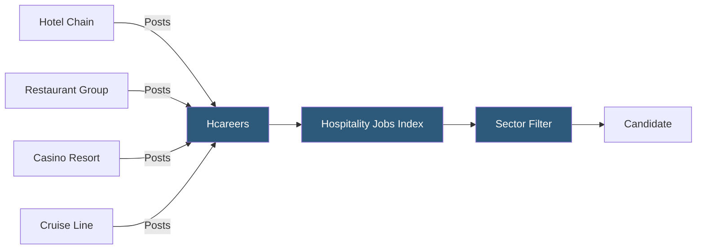

**Category:** Industry-Specific Job Boards
**Difficulty:** Beginner
**Reading time:** 5 min read

---

Hcareers is a dedicated hospitality and hotel industry job board serving front-line service workers, restaurant professionals, event managers, and hotel executives with listings from hotels, restaurants, casinos, and cruise lines.

- **Hospitality Vertical** — the sector encompassing hotels, restaurants, catering, events, gaming, and cruise industries
- **Casino / Gaming Employment** — hotel-casino hybrid properties with gaming, F&B, and entertainment staffing needs
- **Event Management** — roles coordinating weddings, conferences, and corporate events within hotel properties
- **Cruise Line Employment** — maritime hospitality positions requiring willingness to live and work on ships
- **Multi-Unit Management** — district or regional manager roles overseeing multiple restaurant or hotel locations
- **Soft Skills Assessment** — Hcareers' emphasis on service orientation and guest experience competencies in job matching

Hcareers serves the broader hospitality industry beyond just hotels, encompassing restaurants, casino resorts, cruise lines, catering companies, and event venues. This broader scope differentiates it from hotel-focused boards, making it relevant for professionals who move fluidly across hospitality sub-sectors. A banquet manager, for instance, might work at a hotel, a standalone catering company, a cruise line, or a resort casino — Hcareers covers all these scenarios.

The platform provides employer accounts for direct posting and maintains a candidate database that recruiters can search. Hospitality employers, especially large casino resorts and hotel chains, use the database to identify passive candidates with specific experience in gaming operations, luxury service standards, or large-scale banquet management.

Hcareers provides career resources tailored to hospitality: salary guides, resume templates for service industry professionals, and articles on career progression from hourly service roles to management. This content supports candidates navigating a sector with well-defined (but not always well-documented) career ladders. Geographic coverage is predominantly North America with some international listings from multinational chains. The platform competes directly with Hospitality Online and Indeed for hospitality listings, meaning employers typically post to multiple platforms simultaneously.

- Casino resort hiring an entire hotel rooms division team for a new Las Vegas property opening
- Cruise line recruiting F&B staff willing to contract for 6-month shipboard assignments
- Restaurant group seeking regional managers for a multi-state fast-casual expansion
- Event coordinator searching for hotel banquet manager roles in a convention-heavy city market
- Hospitality management graduate targeting luxury hotel brand management trainee programs

| Advantage | Disadvantage |
|-----------|--------------|
| Covers casino, cruise, and restaurant beyond just hotels | Competes with multiple similar platforms without clear differentiation |
| Candidate database supports proactive sourcing | High-volume hourly listings can overshadow management roles in search |
| Career resource content supports professional development | Less specialized than single-sector boards for any one hospitality sub-vertical |
| Multi-sector coverage suits candidates transitioning within hospitality | International coverage limited relative to global hospitality industry size |

- [Hospitality Online Hotel Jobs](hospitality-online-hotel-jobs.md)
- [Culinary Agents Restaurant Jobs](culinary-agents-restaurant-jobs.md)
- [Snagajob Hourly Worker Platform](snagajob-hourly-worker-platform.md)

---
*Part of the [Industry-Specific Job Boards](index.md) category · [Back to Master Index](../../index.md)*
