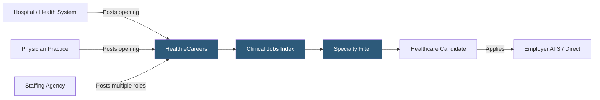

**Category:** Industry-Specific Job Boards
**Difficulty:** Beginner
**Reading time:** 5 min read

---

Health eCareers is a healthcare-focused job board connecting physicians, nurses, allied health professionals, and healthcare administrators with hospitals, health systems, physician groups, and medical staffing agencies across the United States.

- **Allied Health Professional** — non-physician, non-nursing clinical roles including radiology technologists, physical therapists, respiratory therapists, and laboratory scientists
- **Physician Practice** — an individual or group medical practice posting physician and advanced practice provider openings
- **Locum Tenens** — temporary physician placement covering staffing gaps at hospitals and clinics
- **Credentialing** — the verification of a healthcare professional's licenses, certifications, and clinical history required before employment
- **National Provider Identifier (NPI)** — a unique identifier for healthcare providers that platforms use to verify clinical credentials
- **Healthcare Recruiter** — staffing professionals specializing in clinical placement, particularly for hard-to-fill specialized roles

Health eCareers aggregates healthcare job listings and provides direct posting capabilities for employer accounts. The platform covers the breadth of clinical healthcare employment — from physicians and surgeon positions through nursing, pharmacy, behavioral health, and administrative healthcare roles. Medical staffing agencies are major clients, posting volume listings for locum tenens and travel nursing assignments alongside permanent placements.

The search interface prioritizes specialty and licensure as primary filters, because a job seeker's specialty (cardiology, emergency medicine, pediatric nursing, etc.) is typically non-negotiable. Location, practice setting (hospital, outpatient, rural, academic medical center), and employment type (full-time, part-time, locum) are secondary filters. Candidate profiles capture clinical specialties, state licensure, board certification status, and years of experience.

The healthcare sector faces persistent staffing shortages in many specialties, making proactive candidate sourcing critical. Employers with premium accounts access the candidate database to reach passive candidates — particularly experienced professionals who are not actively searching. Health eCareers' relationship with medical associations and specialty societies provides additional reach, since association members are the most relevant audience for specialized clinical roles. Salary transparency is more common on health eCareers than on many general boards, reflecting the standardized compensation structures in healthcare.

- Rural critical access hospital recruiting a family medicine physician willing to work in an underserved area
- Hospital system searching for ICU-certified travel nurses to cover a surge period
- Orthopedic surgical group hiring a physician assistant with MSK specialty experience
- Hospital HR searching for a pharmacy director with health system leadership experience
- Medical staffing agency distributing 200 openings across 50 client facilities simultaneously

| Advantage | Disadvantage |
|-----------|--------------|
| Deep clinical specialty filtering reduces irrelevant applications | Requires understanding of clinical credentials to use effectively |
| Covers both direct employer postings and staffing agency listings | Some listings are from agencies rather than direct employers |
| Passive candidate search database for hard-to-fill specialties | Premium database access adds cost for smaller practices |
| Strong in rural and underserved market healthcare recruitment | Less strong outside the United States |

- [Nurse.com Nursing Jobs](nursecom-nursing-jobs.md)
- [Medzilla Biotech/Pharma Jobs](medzilla-biotechpharma-jobs.md)
- [BioSpace Life Sciences](biospace-life-sciences.md)

---
*Part of the [Industry-Specific Job Boards](index.md) category · [Back to Master Index](../../index.md)*
