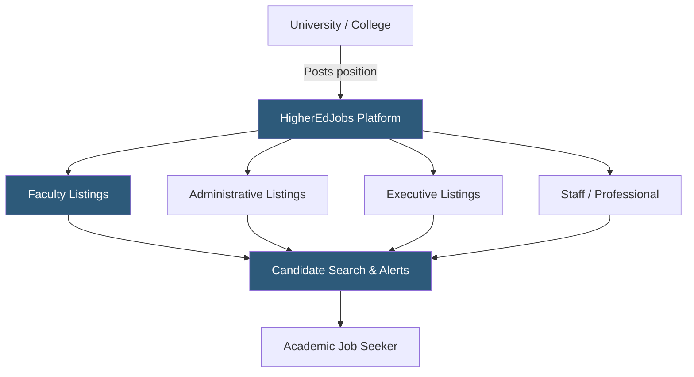

**Category:** Industry-Specific Job Boards
**Difficulty:** Beginner
**Reading time:** 5 min read

---

HigherEdJobs is the leading job board for higher education employment, covering faculty positions, administrative staff, executive leadership, and professional roles at colleges and universities across the United States.

- **Faculty Position** — tenure-track, tenured, or adjunct teaching and research roles at academic institutions
- **Administrative Role** — non-faculty university positions including registrar, financial aid, student affairs, and IT
- **Executive Leadership** — president, provost, dean, and vice chancellor postings typically handled through formal search processes
- **Adjunct / Part-Time Faculty** — non-tenure-track instructional roles, often semester-by-semester contracts
- **Postdoctoral Appointment** — research positions for PhD graduates preparing for faculty careers
- **Job Alert Subscription** — automated notifications triggered by discipline, institution type, or location criteria

HigherEdJobs operates as a subscription and pay-per-post platform for higher education institutions. Member institutions receive discounted posting rates and often bundle their HigherEdJobs subscriptions with HR information systems. The platform covers positions across all academic disciplines and institutional types — community colleges, liberal arts colleges, research universities, and professional schools.

Faculty searches typically follow a rigorous institutional timeline: positions are advertised months before the start date, with initial screening via cover letter, CV, and writing samples. HigherEdJobs supports this process with extended listing durations (often 60-90 days) and applicant tracking integration. The platform's search interface allows candidates to filter by discipline (from accounting to zoology), institutional Carnegie Classification, location, and contract type (tenure-track vs. visiting vs. adjunct).

For administrative and staff positions, institutions post with shorter timescales similar to corporate hiring. HigherEdJobs attracts a professional audience that includes higher education administrators who may be conducting targeted searches for specialized roles like financial aid compliance officers or academic technology directors. The platform also provides salary data, career advice articles, and a newsletter covering trends in academic hiring, helping candidates time their searches to institutional budget cycles and hiring waves.

- Research university advertising tenure-track biology faculty opening for the upcoming academic year
- Community college hiring a Director of Financial Aid with Title IV compliance expertise
- Liberal arts college conducting provost search with nationwide candidate sourcing
- Postdoctoral researcher setting alerts for tenure-track openings in their discipline
- University IT department recruiting an enterprise systems administrator from higher ed-familiar candidates

| Advantage | Disadvantage |
|-----------|--------------|
| Dominant platform for U.S. higher education roles | Primarily U.S. focused; limited international coverage |
| Deep discipline filtering for faculty searches | Highly competitive for tenure-track faculty positions |
| Both faculty and administrative roles on one platform | Long hiring timelines frustrate candidates needing quick placement |
| Extended listing durations match academic search cycles | Adjunct listings often reflect difficult working conditions |

- [Chronicle Vitae Faculty Jobs](chronicle-vitae-faculty-jobs.md)
- [AcademicKeys University Jobs](academickeys-university-jobs.md)
- [Idealist Nonprofit Jobs](idealist-nonprofit-jobs.md)

---
*Part of the [Industry-Specific Job Boards](index.md) category · [Back to Master Index](../../index.md)*
