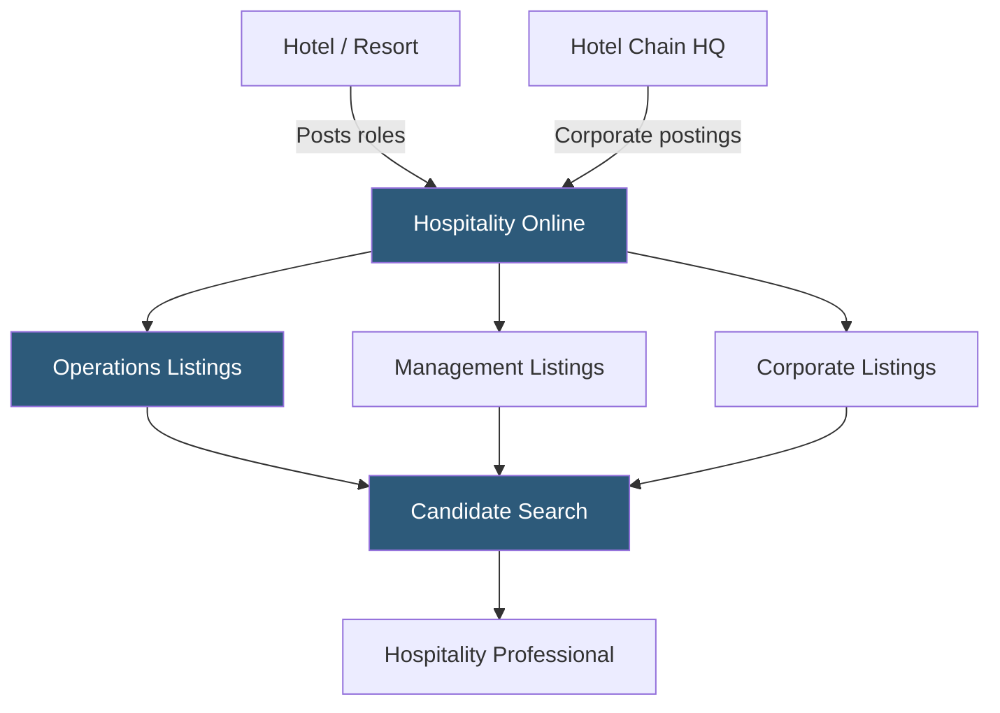

**Category:** Industry-Specific Job Boards
**Difficulty:** Beginner
**Reading time:** 5 min read

---

Hospitality Online is a specialized job board for the hotel, resort, and hospitality industry, connecting front-line service workers, food and beverage staff, hotel managers, and corporate hospitality executives with employers across the lodging sector.

- **Lodging Sector** — the segment of hospitality focused on hotels, resorts, motels, and serviced apartments
- **Front Desk / Front of House** — guest-facing roles including reception, concierge, and bell services
- **Food & Beverage (F&B)** — restaurant, bar, banquet, and catering operations within hotel properties
- **General Manager (GM)** — the senior leadership role at a hotel property responsible for all operational departments
- **Revenue Management** — the discipline of optimizing room pricing and inventory to maximize hotel revenue
- **Hospitality Management Degree** — academic credentials from programs specializing in lodging, F&B, and event management

Hospitality Online aggregates and hosts job listings across the lodging sector from independent boutique hotels to major chains like Marriott, Hilton, and IHG. The platform covers the full employment hierarchy — hourly service roles (housekeeper, front desk agent, server) through department heads (Executive Housekeeper, Director of F&B) and property leadership (General Manager, Regional Director of Operations) to brand-level corporate roles in revenue management, sales, and marketing.

Candidates create profiles specifying their hospitality experience, areas of expertise (rooms division, F&B, spa, events), brand affiliations, and geographic preferences. The ability to indicate brand experience is particularly useful in hotel hiring, where chains value familiarity with proprietary PMS systems (Opera, Fosse) and brand service standards.

Hospitality is characterized by high turnover at the hourly level and highly competitive markets for management talent at destination resorts and luxury properties. Hospitality Online's listings reflect this dual reality — volume listings for entry-level service roles alongside executive search-level postings for leadership positions. The platform also covers seasonal hiring, which is critical in resort destinations with pronounced summer or winter peaks that require rapid staff augmentation. Geographic coverage is U.S.-focused but includes international resort destinations with significant U.S.-headquartered management companies.

- Resort hotel hiring an Executive Chef and entire F&B team ahead of a seasonal opening
- Hotel management company recruiting a GM with branded full-service hotel experience
- Front desk agent searching for roles at luxury boutique hotels in a specific city market
- Corporate hotel chain posting a regional revenue manager opening to hospitality-savvy candidates
- Recent hospitality management graduate searching for management trainee programs

| Advantage | Disadvantage |
|-----------|--------------|
| Lodging-specific audience reduces irrelevant applications | High hourly turnover means listings refresh rapidly — timing matters |
| Covers hourly through executive roles in one platform | Generalist boards like Indeed are also heavily used in hospitality |
| Brand-affiliation filtering suits chain hotel hiring | Limited depth for restaurants and event venues beyond hotel F&B |
| Seasonal hiring coverage supports resort staffing cycles | International coverage outside U.S.-managed properties is thin |

- [Hcareers Hospitality Careers](hcareers-hospitality-careers.md)
- [Culinary Agents Restaurant Jobs](culinary-agents-restaurant-jobs.md)
- [Snagajob Hourly Worker Platform](snagajob-hourly-worker-platform.md)

---
*Part of the [Industry-Specific Job Boards](index.md) category · [Back to Master Index](../../index.md)*
