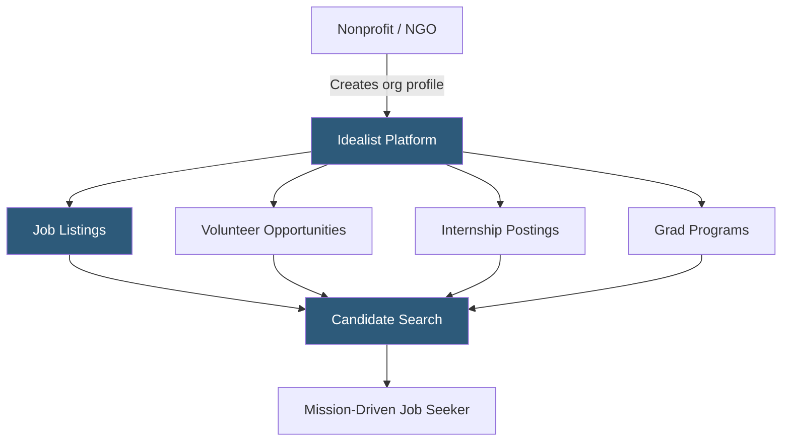

**Category:** Industry-Specific Job Boards
**Difficulty:** Beginner
**Reading time:** 5 min read

---

Idealist is a mission-driven job board and resource hub connecting nonprofit organizations, NGOs, government agencies, and social enterprises with candidates motivated by social impact. It hosts full-time jobs, internships, volunteer opportunities, and graduate school programs alongside career content.

- **Mission-Driven Employment** — roles at organizations prioritizing social, environmental, or civic outcomes over profit
- **Volunteer Listings** — unpaid opportunities that attract candidates interested in sector entry or skills-based giving
- **Nonprofit Organization Profile** — a verified employer page showcasing mission, programs, and culture
- **Graduate Program Listings** — social impact master's and certificate programs advertised alongside jobs
- **Impact Areas** — Idealist's taxonomy classifying organizations by cause: education, environment, health, human rights, etc.
- **Internship Postings** — structured short-term positions common in the nonprofit sector for emerging professionals

Idealist operates on a freemium model: nonprofit organizations can post a limited number of free listings, with paid tiers unlocking higher posting volumes and featured placement. The platform verifies that posting organizations are genuinely nonprofit or mission-aligned, which maintains the quality and trust of the candidate audience.

Candidates create profiles with skills, cause interests, and location preferences. The search interface supports filtering by impact area, organization type, role function, and whether the position is in-person, hybrid, or remote. Idealist's candidate base skews toward career changers entering the nonprofit sector, recent graduates, and professionals with existing sector experience seeking advancement.

The volunteer and internship sections serve an important pipeline function — many candidates who begin with volunteer work at an organization eventually apply for paid roles. This creates a discovery mechanism that traditional job boards lack. Idealist also publishes a resource library covering nonprofit careers, salary negotiation in the sector, and transitioning from for-profit employment. The platform maintains a global index though coverage is heaviest in North America and Western Europe, reflecting the geographic distribution of formal nonprofit infrastructure.

- Environmental NGO recruiting a development director to lead fundraising campaigns
- New graduate searching for entry-level program coordinator roles in international development
- Social enterprise posting a full-time data analyst position for a community health initiative
- University graduate program advertising a social impact MBA to Idealist's engaged audience
- Mid-career professional transitioning from corporate marketing to nonprofit communications

| Advantage | Disadvantage |
|-----------|--------------|
| Deeply targeted mission-driven candidate pool | Salary ranges often below market due to sector norms |
| Volunteer and internship listings drive long-term pipeline | Smaller total listings volume than generalist boards |
| Organization verification maintains platform integrity | Limited geographic reach outside North America |
| Free tier makes it accessible to small nonprofits | Featured placement costs can challenge small-budget orgs |

- [PhilanthropyNews Nonprofit Careers](philanthropynews-nonprofit-careers.md)
- [Nonprofit Talent Nonprofit Jobs](nonprofit-talent-nonprofit-jobs.md)
- [HigherEdJobs Academic Positions](higheredjobs-academic-positions.md)

---
*Part of the [Industry-Specific Job Boards](index.md) category · [Back to Master Index](../../index.md)*
