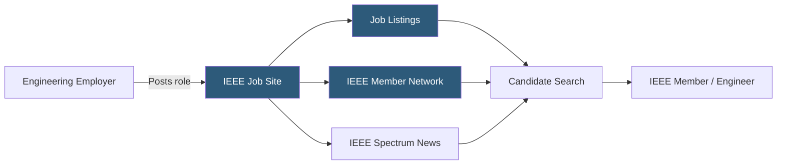

**Category:** Industry-Specific Job Boards
**Difficulty:** Beginner
**Reading time:** 5 min read

---

The IEEE Job Site is the career platform operated by the Institute of Electrical and Electronics Engineers, the world's largest technical professional organization, providing engineering and technology job listings to IEEE's global membership of over 400,000 professionals.

- **IEEE Membership** — professional affiliation with the world's largest engineering society, signaling technical credentialing and professional development
- **IEEE Sections and Chapters** — geographic and technical subdivisions of IEEE that host events and networking opportunities supplementing the job board
- **Electrical Engineering** — the core discipline IEEE represents, encompassing power systems, electronics, communications, and control systems
- **IEEE Spectrum** — IEEE's flagship technology magazine, whose audience overlaps extensively with the job site's candidate base
- **Technical Committees** — IEEE's specialized working groups covering emerging areas like AI, IoT, and quantum computing relevant to job categories
- **Graduate Student Member** — a key demographic using IEEE Job Site during academic-to-industry transitions

The IEEE Job Site benefits from IEEE's institutional credibility and its direct relationship with the professional engineering community. When engineers join IEEE for access to technical publications, conference papers, and standards, they also become reachable for career opportunities through the job site. This pre-existing relationship creates a warmer audience than cold-traffic job boards — candidates are already engaged with IEEE as a professional institution.

Employers who post on IEEE Job Site are specifically targeting electrical, electronics, computer, and related engineering talent. The audience skews technical: IEEE members are predominantly practicing engineers, engineering researchers, and engineering managers rather than general technologists. This makes the platform particularly effective for roles requiring deep electrical or electronic engineering expertise — power systems engineers, antenna design specialists, semiconductor device engineers — that would get lost in the noise of generalist platforms.

The platform supports global hiring given IEEE's international membership base. Engineering talent for specialized roles often needs to be sourced globally, and IEEE's presence in academic and research institutions worldwide creates a candidate pool that includes top graduates from programs in India, China, and Europe alongside experienced professionals. Job listings remain visible to IEEE members worldwide unless geographically restricted, supporting international sourcing.

- Power utility hiring a protection and controls engineer with IEC 61850 substation automation expertise
- Semiconductor company recruiting an analog IC design engineer from a research-oriented candidate base
- Communications equipment manufacturer posting a signal processing engineer role requiring DSP expertise
- Defense contractor sourcing a radar systems engineer from IEEE's antennas and propagation community
- IEEE student member transitioning from graduate school to industry searching for first engineering role

| Advantage | Disadvantage |
|-----------|--------------|
| Direct access to IEEE's 400K+ engineering professional membership | More narrowly focused on EE/ECE disciplines than multi-discipline boards |
| Global reach through IEEE's international academic presence | IEEE membership required to fully access job site features |
| High-credibility employer brand for technical role advertising | Less effective for software engineering compared to tech-specific boards |
| Good for research-oriented and graduate-level technical roles | Smaller total listing volume than aggregator platforms |

- [EngineerJobs.com](engineerjobscom.md)
- [iHireEngineering Jobs](ihireengineering-jobs.md)
- [Dice Tech Job Board](dice-tech-job-board.md)

---
*Part of the [Industry-Specific Job Boards](index.md) category · [Back to Master Index](../../index.md)*
