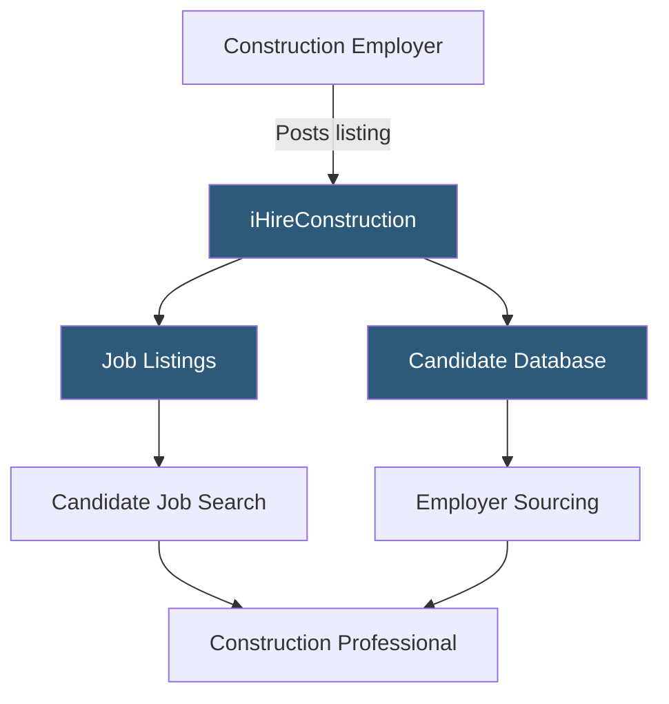

**Category:** Industry-Specific Job Boards
**Difficulty:** Beginner
**Reading time:** 5 min read

---

iHireConstruction is part of the iHire network of 57 industry-specific job boards, serving the construction and skilled trades industry with listings for project managers, estimators, superintendents, foremen, and skilled tradespeople.

- **iHire Network** — a family of 57 profession-specific job boards sharing common platform technology and employer tools
- **Skilled Trades** — licensed or certified trade occupations including electricians, plumbers, HVAC technicians, and welders
- **Green Building / LEED** — sustainable construction certifications increasingly requested by commercial construction employers
- **OSHA Certification** — required safety credentials (OSHA 10, OSHA 30) for construction site workers and supervisors
- **Construction Technology** — BIM (Building Information Modeling), Procore, and estimating software expertise increasingly valued
- **Prevailing Wage Projects** — public works contracts subject to government-mandated wage scales relevant to some listings

iHireConstruction operates on the same technology stack as all 57 iHire network boards, providing a consistent user experience for candidates who may use multiple iHire platforms (a construction PM might also use iHireEngineering). Employers benefit from the network's proven job board infrastructure including applicant tracking, candidate messaging, and profile management.

The platform hosts listings for the full construction employment ecosystem — from entry-level laborers and apprentices through journeymen and foremen to project managers, estimators, and executive leadership. Skilled trades listings are prominent, addressing the well-documented shortage of licensed electricians, plumbers, and HVAC technicians in the U.S. Employers can filter candidate database searches by certification (OSHA 30, LEED AP, PMP), years of experience, and trade specialization.

One distinguishing feature of the iHire network model is the career resources and salary data the platform provides for each profession. iHireConstruction publishes construction salary surveys and career guides that attract candidates researching career paths in the trades, not just active job seekers. This broader audience provides value for employer brand advertising beyond direct listings. The platform supports both direct hires and staffing agency postings, which is particularly relevant for construction given the project-based nature of employment with frequent agency-facilitated placements.

- Electrical contractor finding licensed journeyman electricians in a high-demand metro market
- General contractor hiring an OSHA 30-certified safety manager for a new federal project
- Construction tech startup recruiting a BIM coordinator with Autodesk Revit expertise
- Mechanical subcontractor searching for HVAC project managers with design-build experience
- Construction staffing agency posting temporary laborers and equipment operators for a dam project

| Advantage | Disadvantage |
|-----------|--------------|
| iHire network infrastructure provides reliable, tested platform | Less name recognition than ConstructionJobs.com in some markets |
| Certification and trade filter supports precise candidate matching | Skilled trades shortage persists regardless of platform used |
| Career resources attract passive candidates to the platform | Craft worker hiring often relies more on union halls than job boards |
| Salary data helps set competitive wage offerings | Volume of iHire boards may dilute construction-specific specialization |

- [ConstructionJobs.com](constructionjobscom.md)
- [Rigzone Oil and Gas Jobs](rigzone-oil-and-gas-jobs.md)
- [iHireVeterinary Veterinary Jobs](ihireveterinary-veterinary-jobs.md)

---
*Part of the [Industry-Specific Job Boards](index.md) category · [Back to Master Index](../../index.md)*
