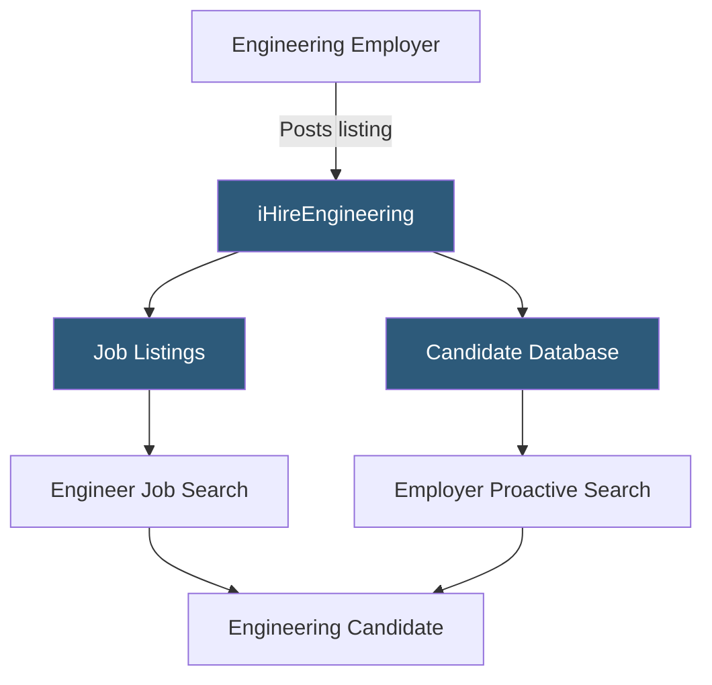

**Category:** Industry-Specific Job Boards
**Difficulty:** Beginner
**Reading time:** 5 min read

---

iHireEngineering is part of the iHire network of 57 industry-specific job boards, serving engineering professionals across mechanical, electrical, civil, chemical, industrial, and aerospace disciplines with a candidate database and employer posting tools.

- **iHire Network** — a family of 57 profession-specific job boards on a shared platform infrastructure
- **Multi-Discipline Engineering** — coverage spanning all major engineering fields in one unified interface
- **Candidate Profile Database** — a searchable repository of engineer resumes and profiles that employers query proactively
- **iHire TalentScout** — iHire's AI-assisted matching technology that surfaces relevant candidates for employer searches
- **Salary Benchmarking** — annual compensation surveys by engineering discipline and experience level published by iHire
- **Career Resources** — resume templates, interview guides, and career path articles targeted to engineering professionals

iHireEngineering serves the engineering hiring market through two parallel mechanisms: inbound (candidates searching posted listings) and outbound (employers searching the candidate database). Both mechanisms are included in the standard employer subscription, which distinguishes iHire from pay-per-listing models.

The platform covers engineering broadly — including mechanical design, electrical systems, civil infrastructure, chemical process, industrial optimization, and software engineering. This breadth makes it useful for small and mid-size manufacturers, engineering consultancies, and construction firms that hire across multiple engineering disciplines simultaneously. A plant engineering manager might need a mechanical engineer, an electrical controls engineer, and a process safety engineer simultaneously — iHireEngineering hosts all three.

iHire's TalentScout feature applies algorithmic matching to surface relevant candidates from the database when employers post a job, rather than requiring manual database searches. This suits HR generalists at manufacturing companies who lack specialized engineering recruiting expertise. The matching considers title, skills, experience level, and location to generate candidate recommendations.

The career resources content — resume templates formatted for engineering CVs, articles on engineering interview preparation, and compensation guides — attracts engineering professionals to the platform between active job searches. This passive audience benefits employer brand advertising and increases the platform's candidate database size over time.

- Mid-size manufacturing company hiring a mechanical design engineer and an electrical controls engineer simultaneously
- Engineering consultancy recruiting five civil engineers for a new transportation infrastructure practice
- Chemical plant seeking a process safety engineer with PSM (Process Safety Management) compliance experience
- Industrial engineering manager targeting candidates open to relocation for a plant operations role
- Entry-level mechanical engineer using career resources to prepare application materials

| Advantage | Disadvantage |
|-----------|--------------|
| Cross-discipline coverage suits multi-discipline engineering employers | Less specialized than IEEE Job Site for EE/ECE roles specifically |
| Subscription includes both listings and database search | iHire network may dilute brand recognition vs. engineering-specific platforms |
| TalentScout matching helps HR generalists find relevant candidates | Software engineering roles better served by Dice or Stack Overflow |
| Salary benchmarking helps set competitive engineering compensation | Defense/cleared engineering roles better served by specialized clearance boards |

- [EngineerJobs.com](engineerjobscom.md)
- [IEEE Job Site Engineering](ieee-job-site-engineering.md)
- [iHireConstruction Jobs](ihireconstruction-jobs.md)

---
*Part of the [Industry-Specific Job Boards](index.md) category · [Back to Master Index](../../index.md)*
