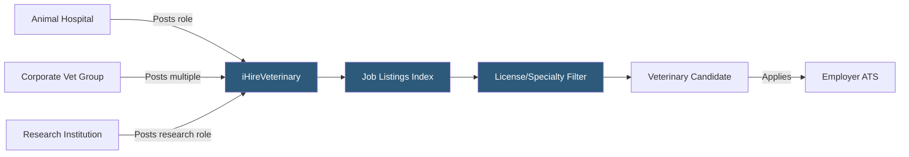

**Category:** Industry-Specific Job Boards
**Difficulty:** Beginner
**Reading time:** 5 min read

---

iHireVeterinary is a specialized career platform serving the veterinary sector, connecting veterinarians, veterinary technicians, and practice managers with animal hospitals, specialty clinics, research institutions, and corporate veterinary groups.

- **Veterinarian (DVM/VMD)** — a licensed doctor of veterinary medicine, the primary candidate type for clinical practice roles
- **Veterinary Technician (VT/CVT)** — a licensed technical professional supporting veterinary clinical procedures
- **Specialty Practice** — a veterinary practice offering advanced care in areas like surgery, oncology, cardiology, or neurology
- **Corporate Veterinary Group** — a multi-site ownership model (VCA, Banfield, Mars Veterinary Health) with centralized HR
- **Relief/Locum Veterinarian** — a temporary veterinarian covering practice gaps, analogous to locum tenens in human medicine
- **iHire Network** — a family of industry-specific job boards sharing technology infrastructure across 57 professional verticals

iHireVeterinary is one of 57 industry-specific job boards in the iHire network, each sharing a common platform architecture tailored for a specific profession. This shared infrastructure means iHireVeterinary benefits from proven technology and employer tooling while presenting a profession-specific brand and candidate experience.

The platform hosts listings from independent animal hospitals, specialty and emergency veterinary practices, corporate veterinary chains, government and military veterinary services, research institutions, and the pharmaceutical/agricultural sectors. Candidates create profiles with licensure details, species experience (small animal, large animal, exotic, mixed practice), clinical specialties, and geographic preferences.

Employers use the platform both for listing-based applications and for proactive resume database searches — critical in the veterinary sector where DVM shortages make sourcing passive candidates necessary. The veterinary profession has experienced persistent workforce shortages accelerated by the pandemic-era pet adoption surge, making recruitment increasingly competitive. iHireVeterinary's targeted candidate pool — which includes both active job seekers and professionals who maintain profiles while employed — gives employers access to the widest feasible pool of credentialed candidates.

The platform also provides salary benchmarking data for veterinary roles by specialty and region, which helps practices set competitive compensation to attract candidates in a tight market.

- Emergency veterinary clinic recruiting a DVM with DACVEC (emergency and critical care) credentials
- Corporate veterinary group hiring 12 staff DVMs across newly acquired practices in the Southeast
- University veterinary college posting a clinical assistant professor of surgery opening
- Small animal practice searching for a certified veterinary technician with anesthesia experience
- Relief veterinarian creating a profile to be discovered by practices needing short-term coverage

| Advantage | Disadvantage |
|-----------|--------------|
| Deep veterinary sector focus delivers relevant candidates only | Smaller total candidate volume than general medical boards |
| iHire network's technology infrastructure is robust | Corporate vet groups dominate listings, creating competition for independent practices |
| Salary benchmarking helps set market-rate compensation | Limited international veterinary job coverage |
| Relief/locum listings alongside permanent roles | DVM shortage means platform alone insufficient; direct networking still required |

- [Health eCareers Medical Jobs](health-ecareers-medical-jobs.md)
- [Nurse.com Nursing Jobs](nursecom-nursing-jobs.md)
- [iHireConstruction Jobs](ihireconstruction-jobs.md)

---
*Part of the [Industry-Specific Job Boards](index.md) category · [Back to Master Index](../../index.md)*
