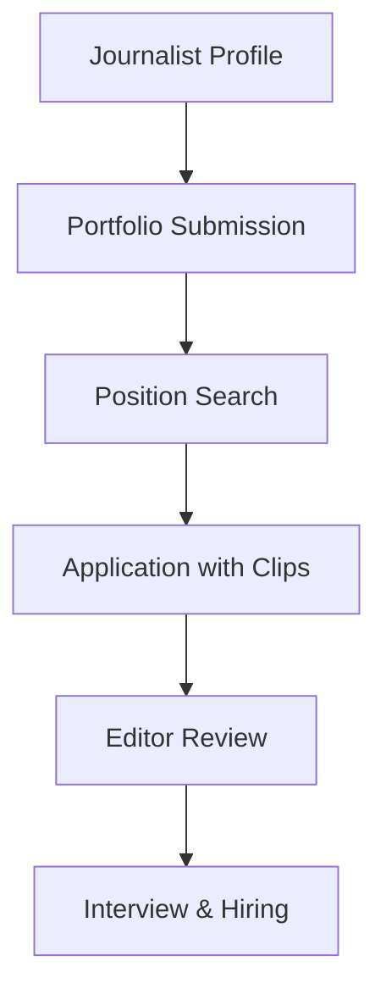

**Category:** Industry-Specific Job Boards
**Difficulty:** Intermediate
**Reading time:** 6 min read

---

JournalismJobs.com is a dedicated job board for journalists, editors, and media professionals. It connects reporters and editors with news organizations, publications, and media outlets seeking journalism talent.

- **Editorial Positions** — journalist, reporter, editor, and assignment editor roles
- **Media Outlet Diversity** — listings from newspapers, magazines, radio, television, and digital media
- **Geographic Coverage** — national and international journalism positions
- **Beat Specialization** — roles filtered by news beats (politics, business, sports, technology)
- **Entry-Level to Experienced** — positions for journalism school graduates through veteran journalists

Journalists build profiles highlighting their beats, experience, and portfolio samples (clips). The search interface filters by position type, media format, geographic location, and news beats. Job listings come directly from news organizations seeking editorial staff. Applications typically include writing samples demonstrating journalism quality and style. Editors review clips to assess reporting depth and writing ability. The platform connects journalists with entry-level positions at smaller publications and experienced roles at major news organizations. Freelance and contract journalism opportunities supplement full-time positions. Industry resources include journalism news and career development content.

- Reporters seeking positions at regional and national newspapers
- Online news editor roles at digital-native publications
- Broadcast journalists for radio and television news operations
- Magazine editors for trade publications and consumer titles
- Freelance journalism opportunities for independent writers

| Advantage | Disadvantage |
|-----------|--------------|
| Specialized platform with high industry engagement | Declining traditional media limits job growth |
| Editors efficiently identify qualified journalism talent | Lower salaries in journalism compared to other fields |
| Portfolio samples provide transparent candidate assessment | Competitive field with oversupply of journalism graduates |
| Covers print, broadcast, and digital media | Geographic concentration in major media markets |
| Direct contact with hiring editors streamlines process | Uncertain long-term career stability in journalism |

- [MediaJobsDaily Media Careers](mediajobsdaily-media-careers.md)
- [Media Industry Careers](../../index.md)
- [Content Creation Jobs](../../index.md)

---
*Part of the [Industry-Specific Job Boards](index.md) category · [Back to Master Index](../../index.md)*
