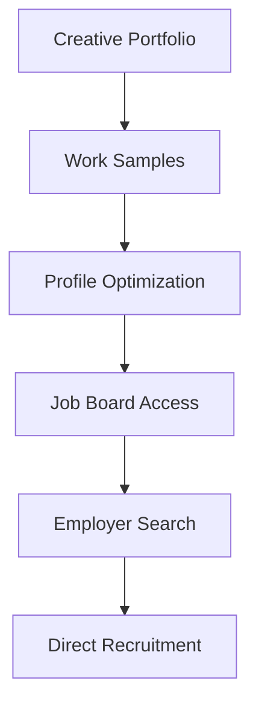

**Category:** Industry-Specific Job Boards
**Difficulty:** Intermediate
**Reading time:** 6 min read

---

Krop is a job board and portfolio platform for creative professionals including designers, art directors, photographers, and other creative specialists. It combines job listings with portfolio hosting enabling employers to discover creative talent and applicants to showcase their work.

- **Portfolio Hosting** — integrated platform for hosting creative work samples
- **Creative Discipline Specialization** — positions for diverse creative roles
- **Employer Portfolio Browsing** — companies can search portfolios by style and skill
- **International Reach** — global platform connecting international creative talent
- **Agency and In-House Roles** — opportunities with creative agencies and corporate creative teams

Creative professionals build Krop portfolios uploading work samples, project descriptions, and professional information. Portfolio optimization through tagging and categorization improves discoverability. Job listings appear alongside portfolio content with detailed position information. Employers can search portfolios by creative discipline, style, location, and specific skills needed. The platform enables direct messaging between employers and creative professionals. Application tracking tools help manage candidate pipelines. Portfolio analytics show viewer engagement and application interest. Community features including inspiration galleries and creative showcases support professional development.

- Graphic designers and art directors finding design positions
- Photographers and photo directors seeking photography work
- Illustrators and digital artists discovering illustration opportunities
- Creative directors and design leads for agency and corporate roles
- Freelance creative professionals finding project-based work

| Advantage | Disadvantage |
|-----------|--------------|
| Portfolio-driven approach showcases creative work directly | Requires quality portfolio for success |
| International reach expands job opportunities globally | Time zone differences may complicate communication |
| Integrated platform streamlines job search and application | May overvalue visual portfolio over experience |
| Employer portfolio browsing reduces application volume | Subjective aesthetic judgment affects hiring |
| Community support and professional development resources | Fee structure may limit value for some users |

- [Coroflot Design Jobs](coroflot-design-jobs.md)
- [CreativeHotlist Creative Jobs](creativehotlist-creative-jobs.md)
- [Creative Portfolios](../../index.md)

---
*Part of the [Industry-Specific Job Boards](index.md) category · [Back to Master Index](../../index.md)*
