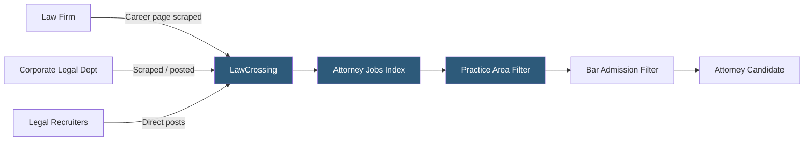

**Category:** Industry-Specific Job Boards
**Difficulty:** Intermediate
**Reading time:** 6 min read

---

LawCrossing is a specialized legal career platform operated by Employment Crossing, aggregating attorney job listings, paralegal positions, and legal support roles from law firm career pages, legal recruiting firms, and corporate legal departments.

- **Attorney Job Market** — the legal employment ecosystem spanning BigLaw, boutique firms, in-house counsel, government, and public interest
- **BigLaw** — the top 200 large law firms by revenue, characterized by high salaries, long hours, and structured associate programs
- **In-House Counsel** — attorneys employed by corporations as employees rather than law firm associates or partners
- **Lateral Hiring** — the movement of experienced attorneys between law firms, distinct from the entry-level associate pipeline
- **Practice Area** — a lawyer's specialization (corporate M&A, litigation, IP, tax, etc.) which is the primary sorting dimension in legal hiring
- **Bar Admission** — state-level attorney licensing requirements that determine geographic eligibility for law firm roles

LawCrossing aggregates legal job listings from law firm career pages, corporate legal department postings, government attorney positions, and legal recruiting firms. The aggregation model is central to the platform's value proposition — many law firms prefer discrete hiring and post only to their own career pages rather than advertising broadly on public job boards. LawCrossing's crawling captures these listings before they expire, creating a more comprehensive index than manual searching of individual firm websites.

The platform requires candidates to subscribe for full access to listings and application details. This paid model is positioned toward serious legal professionals making deliberate career moves, and the cost is justified relative to the legal sector's salary levels. The practice area and geographic (bar admission) filters are the primary navigation dimensions, reflecting how legal hiring actually works: a corporate M&A associate with NY bar admission looking for a partner-track lateral move needs to filter precisely on both dimensions simultaneously.

Legal recruiting firms — headhunters and placement specialists — post listings on LawCrossing for roles they're actively recruiting, supplementing direct employer listings. The legal lateral market for associates and partners involves legal search consultants to a greater degree than most industries, making recruiter-sourced listings a meaningful part of the job landscape. LawCrossing's database is also used by legal recruiters themselves to identify candidates with specific practice backgrounds for outreach. The platform covers all seniority levels from summer associate through senior partner, but lateral associate and in-house counsel transitions are the highest-activity use cases.

- Third-year BigLaw associate seeking a lateral move to a peer or better-ranked firm in the same practice area
- Mid-level corporate attorney researching in-house transition opportunities at technology companies
- Legal recruiter sourcing litigation associates with Ivy League credentials for a top-50 firm search
- Government attorney seeking private sector transition to a regulatory practice group
- Paralegal specializing in real estate closings searching for specialist paralegal roles at regional firms

| Advantage | Disadvantage |
|-----------|--------------|
| Comprehensive aggregation captures listings not posted to public boards | Subscription fee required for full access — creates friction |
| Practice area and bar admission filters match legal hiring realities | Aggregated listings from firm career pages may expire without notice |
| Legal recruiter postings provide access to confidential search mandates | Less transparent about which listings are from headhunters vs. direct employers |
| Covers all market segments from BigLaw to public interest | NALP and law school OCI pipelines dominate entry-level — LawCrossing more useful laterally |

- [Legal Staff Legal Support Jobs](legal-staff-legal-support-jobs.md)
- [eAttorney Legal Careers](eattorney-legal-careers.md)
- [eFinancialCareers Finance Jobs](efinancialcareers-finance-jobs.md)

---
*Part of the [Industry-Specific Job Boards](index.md) category · [Back to Master Index](../../index.md)*
