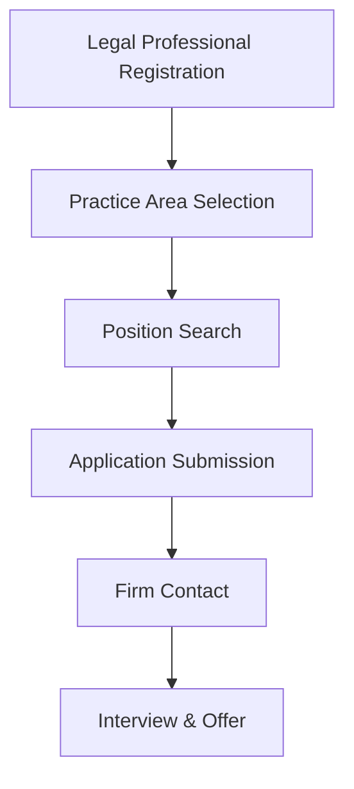

**Category:** Industry-Specific Job Boards
**Difficulty:** Intermediate
**Reading time:** 6 min read

---

Legal Staff is a specialized job board focused on legal careers including attorney positions, paralegal roles, legal secretary positions, and law firm management. It serves the legal profession with listings from law firms, corporate legal departments, and legal service providers.

- **Practice Area Specialization** — filtering by litigation, corporate, intellectual property, family law, etc.
- **Experience Level Targeting** — positions categorized by seniority from entry-level to partner-track
- **Geographic Focus** — location-based search reflecting legal market density in major cities
- **Firm Profile Visibility** — law firm profiles showcasing practice areas and culture
- **Salary Benchmarking** — compensation data for different practice areas and experience levels

Legal professionals complete profiles highlighting bar admission status, practice areas, and years of experience. The search interface allows filtering by position type (attorney, paralegal, legal tech), practice area, location, and firm size. Job listings from law firms detail specific requirements and practice specializations. Application processes vary but typically involve direct submission to hiring partners or managing attorneys. The platform provides market intelligence on legal profession hiring trends and compensation. Premium features include resume enhancement and networking with legal recruiters. Legal industry news and continuing legal education opportunities supplement job listings.

- Attorneys seeking partnership track or lateral moves to new firms
- Paralegals and legal secretaries finding specialized practice area positions
- Corporate in-house counsel recruiting department leaders
- Legal service providers seeking professional staff
- Law firm administrators and business operations roles

| Advantage | Disadvantage |
|-----------|--------------|
| Specialized audience attracts serious candidates and employers | Limited to legal profession decreasing job volume |
| Detailed practice area filtering improves matching | Requires legal credentials for most positions |
| Strong professional reputation in legal community | Geographic concentration in major legal markets |
| Salary transparency helps negotiate compensation | Less visibility than general job platforms |
| Connects candidates with legal recruiters | Niche focus limits appeal for career changers |

- [eAttorney Legal Careers](eattorney-legal-careers.md)
- [Professional Job Boards](../../index.md)
- [Legal Careers](../../index.md)

---
*Part of the [Industry-Specific Job Boards](index.md) category · [Back to Master Index](../../index.md)*
