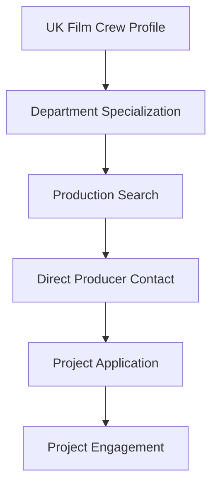

**Category:** Industry-Specific Job Boards
**Difficulty:** Intermediate
**Reading time:** 6 min read

---

Mandy.com is a UK-based film and television industry platform with extensive job listings for crew positions. It serves British and European production industries connecting crew with studios and independent productions.

- **UK/European Focus** — specialization in British film and television productions
- **Crew Directories** — searchable databases of crew members and their specializations
- **Production Listings** — active productions seeking crew across all departments
- **Industry Community** — networking and professional features for crew members
- **Freelance and Contract Work** — flexible employment typical of production industry

Film crew members register with detailed information about specialization, experience, equipment, and availability. The platform maintains searchable crew directories enabling producers to find specialists by department (camera, sound, lighting, etc.). Active production listings include project details, timeline, and crew requirements. Direct messaging connects crew with producers and production managers. The platform emphasizes authentic industry connections filtering out scams and inappropriate listings. A user rating system builds community trust. Industry forums discuss production techniques and career development. Premium features for productions include featured listings and crew database access enabling efficient hiring.

- Camera operators and cinematography specialists for film and TV
- Sound engineers and audio technicians
- Lighting technicians and gaffers
- Production assistants and runners
- Specialized crew for niche departments

| Advantage | Disadvantage |
|-----------|--------------|
| Strong European production focus matches regional market | Limited North American job listings |
| Established platform with trusted community | Project-based income variability |
| Crew directory enables proactive discovery | Lower compensation than studio positions |
| Authentic production community with scam filtering | Geographic dependence on production locations |
| Premium features support efficient hiring | Highly competitive crew market |

- [ProductionHUB Film/Video Jobs](productionhub-film-video-jobs.md)
- [Entertainment Careers Hollywood](entertainment-careers-hollywood.md)
- [Film Crew Careers](../../index.md)

---
*Part of the [Industry-Specific Job Boards](index.md) category · [Back to Master Index](../../index.md)*
