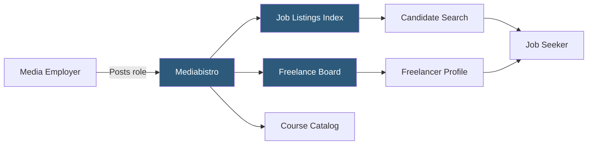

**Category:** Industry-Specific Job Boards
**Difficulty:** Beginner
**Reading time:** 5 min read

---

Mediabistro is a specialized career platform for media, journalism, publishing, and communications professionals, offering job listings alongside industry courses, freelance marketplaces, and editorial resources. It serves roles across broadcast, digital media, public relations, and content strategy.

- **Media Vertical** — a job board scoped to journalism, publishing, broadcast, and communications roles
- **Freelance Marketplace** — a feature allowing clients to hire media professionals on a project basis
- **Editorial Content** — articles and guides that attract candidates organically and establish platform authority
- **Course Marketplace** — online training offerings for media skills like copywriting, social media management, and video production
- **Job Alert** — automated email notifications triggered by saved search criteria
- **Employer Branding** — enhanced company profiles allowing media companies to showcase culture and benefits

Mediabistro aggregates job listings from media companies, agencies, and publishers seeking journalists, editors, social media managers, content strategists, PR professionals, and broadcast staff. Employers create company accounts and post listings with detailed requirements. The platform charges per-listing fees or subscription packages with volume discounts for agencies posting multiple roles.

Candidates register profiles with portfolio links, publication credits, and skill tags. The search interface filters by media type (digital, broadcast, print), role category, and location. Mediabistro's freelance section operates somewhat differently: clients post project briefs and freelancers bid or are invited to apply, functioning more like a gig marketplace than a traditional job board.

The platform differentiates itself through its educational arm — courses on digital journalism, SEO for editorial, video production, and social media strategy — which keeps professionals engaged on the platform outside active job searches. This creates a larger addressable audience for employer advertising. Newsletter subscriptions with curated job digests drive return traffic, and editorial features on industry trends position Mediabistro as a trade publication as well as a career service.

- Digital publisher hiring a senior editor with SEO and content strategy experience
- PR agency seeking communications specialists for multiple client campaigns
- Freelance journalist finding short-term contract assignments with major outlets
- Broadcast network posting a video producer role to a targeted media audience
- Media professional upskilling through courses while passively job searching

| Advantage | Disadvantage |
|-----------|--------------|
| Highly targeted media/communications audience | Smaller total candidate volume than generalist boards |
| Freelance marketplace alongside full-time listings | Limited global reach outside English-speaking markets |
| Educational content builds platform loyalty | Course quality varies; not accredited |
| Low noise — candidates are media-focused | Niche scope excludes adjacent tech roles |

- [eFinancialCareers Finance Jobs](efinancialcareers-finance-jobs.md)
- [JournalismJobs.com](journalismjobs-com.md)
- [CreativeHotlist Creative Jobs](creativehotlist-creative-jobs.md)

---
*Part of the [Industry-Specific Job Boards](index.md) category · [Back to Master Index](../../index.md)*
