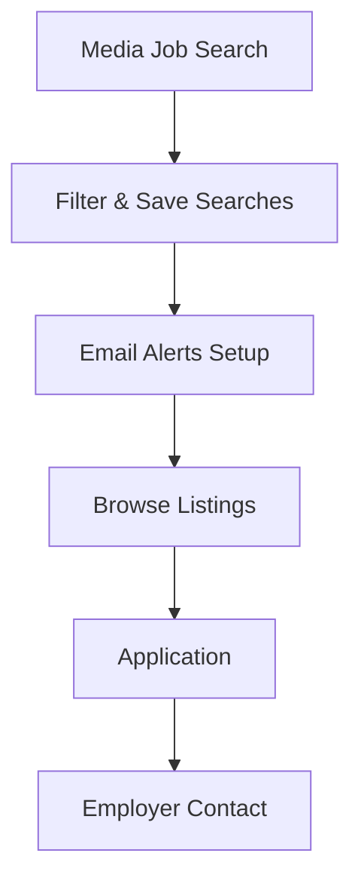

**Category:** Industry-Specific Job Boards
**Difficulty:** Intermediate
**Reading time:** 6 min read

---

MediaJobsDaily is a job board aggregating media and journalism positions from across the industry. It combines listings from news organizations, broadcasters, and media companies in one searchable platform.

- **Job Aggregation** — pulls listings from multiple news organizations and media outlets
- **Real-time Updates** — fresh job postings added continuously throughout the day
- **Filter Options** — search by location, job type, media format, and experience level
- **Email Alerts** — automatic notifications of new postings matching saved criteria
- **Industry News** — media industry updates and hiring trend information

The platform aggregates job listings from major news organizations, local stations, and media outlets through RSS feeds and direct employer submissions. Job seekers search across all aggregated positions using geographic, role type, and experience filters. Email alerts notify subscribers of new postings matching saved search parameters. The dashboard displays trending media jobs and hiring activity. Application links redirect users to employer career pages for submission. The site provides editorial commentary on media industry trends, newsroom changes, and hiring patterns.

- General media career search across multiple outlets
- News management and executive role hunting
- Broadcast operations and technical positions
- Digital media and web production roles
- Media sales and marketing positions

| Advantage | Disadvantage |
|-----------|--------------|
| Comprehensive aggregation saves searching multiple sites | Duplicated listings can create search confusion |
| Real-time updates ensure current opportunities | Quality of aggregated content varies |
| Email alerts reduce time to discovery | Limited ability to save applications |
| Broad coverage across media formats | May include outdated or filled positions |
| Industry context aids decision-making | Less personalized than specialized boards |

- [JournalismJobs.com](journalismjobscom.md)
- [Media Industry Careers](../../index.md)
- [Broadcasting Careers](../../index.md)

---
*Part of the [Industry-Specific Job Boards](index.md) category · [Back to Master Index](../../index.md)*
