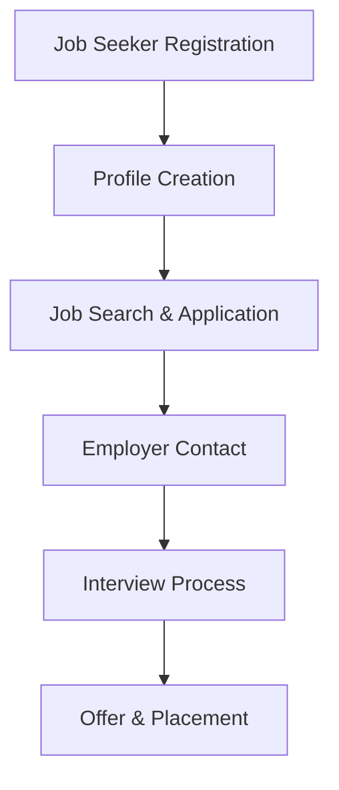

**Category:** Industry-Specific Job Boards
**Difficulty:** Intermediate
**Reading time:** 6 min read

---

Medzilla is a specialized job board dedicated to biotech, pharmaceutical, and life sciences positions. It connects candidates with employers seeking roles in research, development, manufacturing, regulatory affairs, and business functions specific to the healthcare industry.

- **Specialized Filtering** — advanced search by therapeutic area, discipline, and career stage
- **Direct Employer Postings** — listings posted directly by biotech and pharma companies
- **Resume Database** — searchable candidate profiles for recruiters to identify passive candidates
- **Job Alert System** — automated email notifications matching saved search criteria
- **Industry Insights** — market data and trends in biotech/pharma compensation and hiring

Job seekers create profiles with relevant experience, qualifications, and career preferences. The platform's search interface allows filtering by disease area, job function, geography, and company size. Featured job listings highlight actively recruiting companies. Resume databases enable employers to proactively source candidates matching specific requirements. Email alerts notify job seekers when new matching positions are posted. Application tracking systems manage communication between candidates and employers. The platform provides industry salary data and market insights helping candidates understand compensation benchmarks. Premium features for employers include access to the resume database and sponsored job placement in search results.

- Researchers seeking biotech and pharma R&D positions
- Manufacturing and quality professionals finding GMP-regulated roles
- Regulatory affairs specialists with FDA and compliance expertise
- Business development and licensing negotiators
- Clinical operations and medical affairs professionals

| Advantage | Disadvantage |
|-----------|--------------|
| Highly specialized matching relevant candidates and employers | Limited geographic presence outside major biotech hubs |
| Strong industry focus attracts serious candidates | Smaller employer base than general job boards |
| Detailed filtering improves job relevance | Requires biotech/pharma experience for best results |
| Good community reputation in life sciences | Less job volume than larger generalist platforms |
| Employer database searchability valuable for recruiters | Niche focus limits value for career changers |

- [Legal Staff Legal Support Jobs](legal-staff-legal-support-jobs.md)
- [Job Board Strategies](../../index.md)
- [Specialized Recruitment](../../index.md)

---
*Part of the [Industry-Specific Job Boards](index.md) category · [Back to Master Index](../../index.md)*
