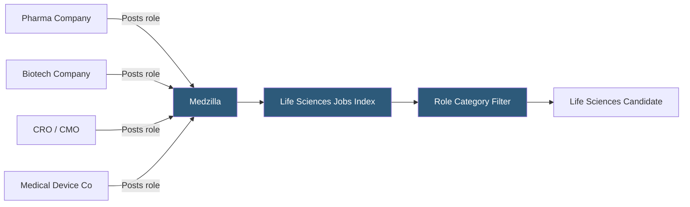

**Category:** Industry-Specific Job Boards
**Difficulty:** Beginner
**Reading time:** 5 min read

---

Medzilla is a specialized job board serving the biotech, pharmaceutical, clinical research, and medical device industries, connecting scientific, regulatory, clinical, and commercial professionals with life sciences employers.

- **Life Sciences Industry** — the sector encompassing pharmaceutical, biotechnology, medical device, and clinical research organizations
- **Regulatory Affairs** — roles ensuring drug, device, or diagnostic products meet FDA and international regulatory requirements
- **Clinical Research Associate (CRA)** — a professional who monitors clinical trials on behalf of sponsors or CROs
- **Contract Research Organization (CRO)** — a company contracted by pharma/biotech to perform clinical research services
- **GxP Compliance** — Good Practice regulations governing manufacturing (GMP), laboratory (GLP), and clinical (GCP) processes
- **Commercial / Sales Roles** — pharmaceutical sales representatives and medical science liaisons who engage healthcare providers

Medzilla aggregates and hosts job listings from across the life sciences value chain — from early-stage biotech startups and large pharmaceutical companies to CROs managing global clinical trials and medical device manufacturers. The platform organizes listings across functional categories: research and development, clinical operations, regulatory affairs, quality assurance, manufacturing, commercial/sales, and medical affairs.

Employers post directly or use Medzilla's resume search service, which allows recruiters to proactively source from the candidate database using filters for scientific discipline (oncology, immunology, CMC chemistry), degree level, regulatory experience, and geographic preference. Life sciences hiring is highly credential-dependent — a regulatory affairs role at an FDA-regulated company requires specific 21 CFR familiarity that would be invisible to a generalist recruiter — making the specialized candidate database particularly valuable.

The life sciences industry has geographic concentrations (Boston/Cambridge, San Francisco Bay Area, San Diego, Research Triangle, New Jersey/Philadelphia corridor), and Medzilla's listings reflect these clusters. However, the shift to decentralized clinical trials and remote regulatory work has broadened geographic distribution. Medzilla's resume database is the product's core commercial offering — companies pay subscription fees for database access, not just for listing visibility, reflecting the difficulty of sourcing specialized life sciences talent in a competitive market.

- Pharmaceutical company recruiting a CMC regulatory affairs specialist for NDA submission
- CRO hiring 20 clinical research associates to staff a Phase III oncology trial
- Biotech startup searching for a Vice President of Regulatory Affairs with FDA Type A meeting experience
- Medical device manufacturer posting a quality engineer role requiring ISO 13485 expertise
- Pharmaceutical sales recruiter sourcing regional business managers with established oncology network

| Advantage | Disadvantage |
|-----------|--------------|
| Deep life sciences specialization filters out irrelevant candidates | Niche scope limits effectiveness for administrative roles |
| Resume database search suits the proactive sourcing model in this sector | Smaller overall candidate pool than BioSpace or LinkedIn |
| Covers the full life sciences value chain in one platform | Less active editorial content than BioSpace |
| Useful geographic clustering around U.S. biopharma hubs | Limited European and Asian life sciences coverage |

- [BioSpace Life Sciences](biospace-life-sciences.md)
- [Health eCareers Medical Jobs](health-ecareers-medical-jobs.md)
- [Nurse.com Nursing Jobs](nursecom-nursing-jobs.md)

---
*Part of the [Industry-Specific Job Boards](index.md) category · [Back to Master Index](../../index.md)*
