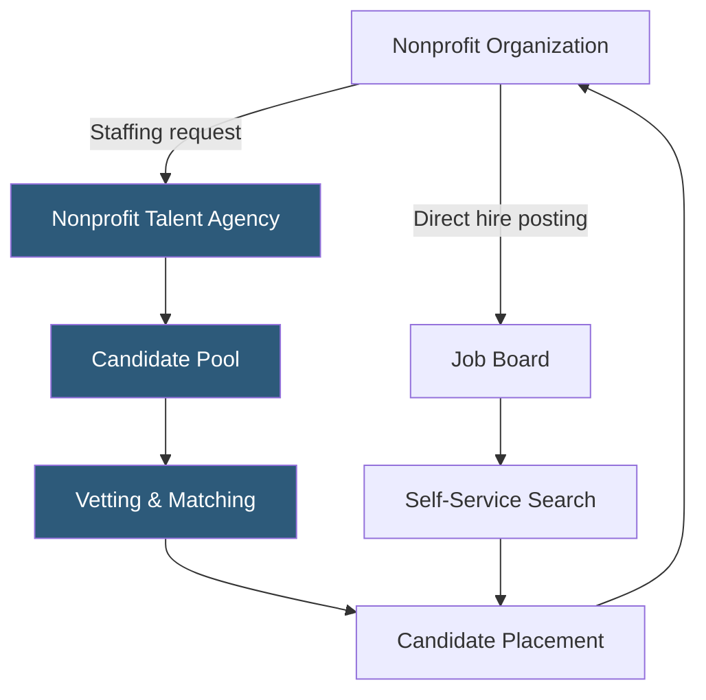

**Category:** Industry-Specific Job Boards
**Difficulty:** Beginner
**Reading time:** 5 min read

---

Nonprofit Talent is a staffing and job board platform that connects mission-driven organizations with candidates seeking full-time, part-time, and contract roles in the nonprofit and social sector, emphasizing diversity, equity, and inclusion in hiring practices.

- **Social Sector Staffing** — recruitment services specifically targeting nonprofit, government, and social enterprise employers
- **DEI-Focused Hiring** — intentional recruiting practices designed to build diverse candidate pipelines for mission-driven roles
- **Contract/Temp Placement** — short-term staffing for nonprofits managing project-based or seasonal work
- **Executive Search** — senior leadership recruitment for CEO, COO, and Director roles at nonprofit organizations
- **Candidate Vetting** — pre-screening processes ensuring candidates have genuine interest and qualification in the sector
- **Employer of Record** — a service where the staffing firm handles HR, payroll, and compliance for contract workers

Nonprofit Talent operates as both a job board and a full-service staffing agency, giving employers two pathways to hire. In the self-service model, organizations post listings that candidates discover through search. In the managed staffing model, Nonprofit Talent's recruiters work directly with employers to understand role requirements, then source, screen, and present qualified candidates from their maintained talent pool.

The agency maintains an active database of candidates who have pre-indicated interest in nonprofit employment. These are not passive LinkedIn users but professionals who have actively engaged with the platform, making them more likely to be genuinely mission-aligned. Recruiters conduct behavioral interviews assessing both technical skills and sector motivation before presenting candidates to client organizations.

Temporary and contract placements serve nonprofits that need to staff up for campaigns, grant-funded projects, or seasonal programs without committing to permanent headcount. The employer of record service handles compliance complexity when nonprofits want to engage talent quickly without establishing new employment agreements. DEI commitments are embedded in sourcing strategies, with explicit outreach to underrepresented professional communities in the sector.

- Youth development nonprofit hiring program staff for a new federally funded initiative
- Foundation seeking a temporary grants manager during a staff transition
- Healthcare nonprofit conducting an executive search for a Chief Program Officer
- Advocacy organization building a diverse communications team through targeted sourcing
- Social enterprise needing contract finance staff for year-end audit preparation

| Advantage | Disadvantage |
|-----------|--------------|
| Pre-vetted mission-aligned candidate pool | Managed staffing adds cost versus direct hire |
| DEI-focused sourcing built into process | Smaller brand recognition than Idealist |
| Contract/temp services handle compliance complexity | Limited geographic coverage outside major U.S. markets |
| Executive search capability for leadership roles | Less useful for highly technical or specialized roles |

- [Idealist Nonprofit Jobs](idealist-nonprofit-jobs.md)
- [PhilanthropyNews Nonprofit Careers](philanthropynews-nonprofit-careers.md)
- [eFinancialCareers Finance Jobs](efinancialcareers-finance-jobs.md)

---
*Part of the [Industry-Specific Job Boards](index.md) category · [Back to Master Index](../../index.md)*
