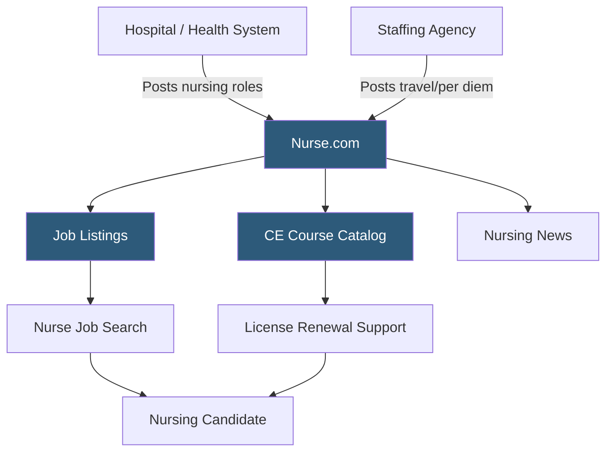

**Category:** Industry-Specific Job Boards
**Difficulty:** Beginner
**Reading time:** 5 min read

---

Nurse.com is a specialized job board and professional community for registered nurses, licensed practical nurses, nurse practitioners, and nursing leadership, combining job listings with continuing education, news, and clinical resources.

- **Registered Nurse (RN)** — a licensed nurse who has passed the NCLEX-RN exam, the primary candidate type on the platform
- **Nurse Practitioner (NP)** — an advanced practice registered nurse with prescriptive authority, commanding higher compensation
- **Travel Nursing** — short-term contract nursing assignments (typically 13 weeks) at hospitals with staffing shortages
- **Per Diem Nursing** — on-call or as-needed nursing shifts without guaranteed hours, often used by nurses supplementing full-time income
- **Specialty Certification** — credentials like CCRN (critical care) or CEN (emergency nursing) that command premium pay
- **Continuing Education Units (CEUs)** — professional development credits required to maintain nursing licensure

Nurse.com is published by OnCourse Learning, a healthcare education company, which means the platform's business model combines job listing revenue with continuing education course sales. This creates a natural synergy: nurses visiting for job searches also encounter CE courses relevant to their specialty and license renewal needs, while those purchasing CE credits are regularly exposed to job listings from healthcare employers.

The job listings span the full nursing employment spectrum: staff RN positions at hospitals and long-term care facilities, advanced practice roles for NPs and CRNAs, travel nursing contracts, per diem casual work, and nursing leadership positions. Travel nursing listings are particularly prominent because agencies post high volumes of travel contracts that need to be filled quickly across the country.

Search filters include specialty unit (ICU, ED, pediatrics, telemetry, etc.), employment type, state, and facility type. Candidate profiles allow nurses to display specialty certifications, licensure states, and years of experience. The nursing shortage has made the platform's candidate database valuable to employers — health systems use it to proactively contact nurses who may be open to opportunities even without actively applying. The editorial nursing news content drives repeat visits from the professional community beyond active job searching.

- ICU nurse comparing travel contracts across multiple staffing agencies on one platform
- Hospital system advertising a night-shift charge nurse opening to specialty-certified RNs
- Nurse practitioner searching for primary care NP roles in outpatient family practice settings
- New graduate RN completing CE requirements while searching for first full-time hospital position
- Nursing school faculty member searching for part-time clinical adjunct teaching opportunities

| Advantage | Disadvantage |
|-----------|--------------|
| Deep nursing specialization attracts targeted candidates | Limited to nursing; allied health roles better served elsewhere |
| CE course integration drives engaged return traffic | Course upsells can feel intrusive during job search workflows |
| Travel and per diem listings well-represented | Agency-heavy listings; some employers prefer direct-hire boards |
| Professional news builds community beyond job searching | Coverage skews U.S.; international nursing recruitment limited |

- [Health eCareers Medical Jobs](health-ecareers-medical-jobs.md)
- [Medzilla Biotech/Pharma Jobs](medzilla-biotechpharma-jobs.md)
- [iHireVeterinary Veterinary Jobs](ihireveterinary-veterinary-jobs.md)

---
*Part of the [Industry-Specific Job Boards](index.md) category · [Back to Master Index](../../index.md)*
