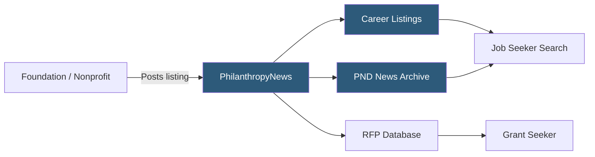

**Category:** Industry-Specific Job Boards
**Difficulty:** Beginner
**Reading time:** 5 min read

---

PhilanthropyNews (Philanthropy News Digest / PND) is a publication and career service operated by Candid (formerly Foundation Center), providing job listings focused on philanthropy, grantmaking foundations, and social sector leadership roles.

- **Philanthropy Sector** — the ecosystem of private foundations, community foundations, corporate giving programs, and grantmaking organizations
- **Candid / Foundation Center** — the parent nonprofit providing foundation data, grants research, and sector intelligence alongside career services
- **Grantmaker Role** — positions at foundations responsible for reviewing grant applications, managing portfolios, and disbursing funding
- **Development Roles** — fundraising positions that seek grants from foundations — distinct from grantmaker roles
- **PND RFP Section** — requests for proposals section helping nonprofits find funding opportunities
- **Sector Intelligence** — Candid's foundation financial data and trend reports that contextualize career decisions

PhilanthropyNews Digest is primarily a curated news service covering the philanthropic sector, with a career listings section that benefits from the publication's established audience of foundation staff, nonprofit leaders, and sector researchers. Job listings appear alongside editorial content covering foundation strategies, major grants, sector trends, and grantmaker profiles.

Organizations post listings directly via a web form, and listings are typically displayed for 30 days. The audience is highly specialized — readers include program officers, foundation executives, development directors, and grant consultants. This makes the platform particularly effective for senior and mid-career roles at foundations and well-funded nonprofits where candidates need sector literacy.

Because Candid maintains the most comprehensive database of U.S. foundation financials (990-PF filings, grants databases), job seekers using PhilanthropyNews also have access to research tools for understanding potential employers' funding priorities, financial health, and grantmaking history. This context-rich environment distinguishes PND from generalist boards where employer research must be done externally. The platform is most effective for U.S.-based philanthropy sector roles, particularly in program management, research, communications, and executive leadership.

- Private foundation seeking a program officer specializing in education grantmaking
- Community foundation posting an executive director opening to sector-savvy candidates
- Nonprofit consultant targeting a foundation-side role in strategic learning and evaluation
- Corporate foundation hiring a grants manager familiar with 990-PF compliance
- Sector researcher looking for roles combining policy analysis with grantmaking

| Advantage | Disadvantage |
|-----------|--------------|
| Highly targeted philanthropy sector audience | Very niche — not suited for general nonprofit roles |
| Candid's foundation data enriches employer research | Smaller listing volume than Idealist |
| Trusted editorial brand in the sector | Limited international foundation coverage |
| Senior/leadership roles well represented | Less effective for entry-level candidates |

- [Idealist Nonprofit Jobs](idealist-nonprofit-jobs.md)
- [Nonprofit Talent Nonprofit Jobs](nonprofit-talent-nonprofit-jobs.md)
- [HigherEdJobs Academic Positions](higheredjobs-academic-positions.md)

---
*Part of the [Industry-Specific Job Boards](index.md) category · [Back to Master Index](../../index.md)*
