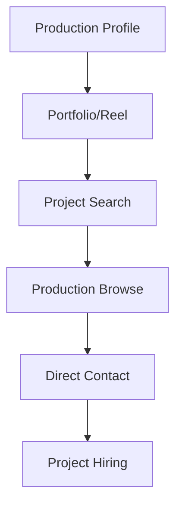

**Category:** Industry-Specific Job Boards
**Difficulty:** Intermediate
**Reading time:** 6 min read

---

ProductionHUB is a production industry platform and job board for film, television, and video production positions. It connects production professionals with studios, production companies, and independent projects seeking crew and talent.

- **Production Crew Positions** — above and below-the-line roles for film and television
- **Project-Based Listings** — one-off production jobs and project-specific hiring
- **Vendor and Service Directory** — listings for production services and equipment rental
- **Portfolio and Reel Showcase** — ability to display work and production credits
- **Industry Networking** — production community features and professional connections

Production professionals create detailed profiles with experience, equipment access, union status, and contact information. Portfolio or reel uploads showcase previous work and production credits. The platform lists production projects with crew requirements and timeline information. Direct messaging enables communication between producers and crew. The vendor directory lists equipment rental, post-production services, and production support businesses. A community forum facilitates networking among production professionals. Calendar features track production schedules and availability. Industry news and production announcements alert professionals to upcoming opportunities. Premium features for productions include featured project listings and access to crew database.

- Cinematographers and camera crew for film and television projects
- Sound engineers and boom operators for production
- Production design and set decoration positions
- Editing and post-production specialists
- Production management and production assistant roles

| Advantage | Disadvantage |
|-----------|--------------|
| Project-specific listings match freelance production work | Inconsistent employment and contract variability |
| Direct producer contact streamlines hiring | Lower compensation than studio positions |
| Portfolio showcase displays production work | Geographic dependence on production locations |
| Vendor directory supports production logistics | Project-to-project income instability |
| Production calendar helps manage schedules | Highly competitive field for crew positions |

- [Entertainment Careers Hollywood](entertainment-careers-hollywood.md)
- [Mandy.com Film Crew Jobs](mandycom-film-crew-jobs.md)
- [Film Production](../../index.md)

---
*Part of the [Industry-Specific Job Boards](index.md) category · [Back to Master Index](../../index.md)*
