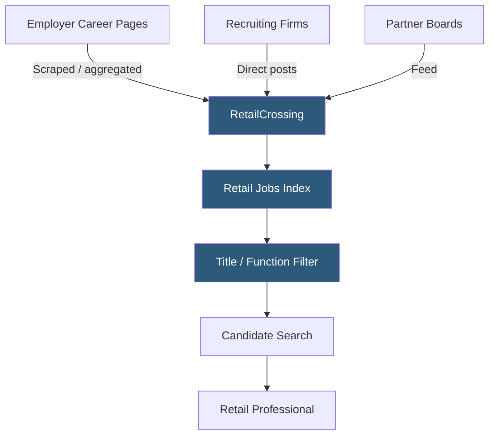

**Category:** Industry-Specific Job Boards
**Difficulty:** Beginner
**Reading time:** 5 min read

---

RetailCrossing is part of the Employment Crossing network of niche job boards, aggregating retail industry job listings from company career pages, recruiting firms, and direct postings into a single searchable resource for retail professionals.

- **Employment Crossing Network** — a family of niche job boards sharing aggregation technology across dozens of industry verticals
- **Deep Aggregation** — RetailCrossing's model of pulling listings directly from employer career sites rather than relying on employer-submitted postings
- **Retail Management Track** — the career progression from associate through department manager to store manager in structured retail organizations
- **Buyer / Planner Role** — corporate retail positions managing assortment selection and inventory planning
- **Retail Operations** — logistics, fulfillment center, and supply chain roles supporting physical and e-commerce retail
- **Subscription Model** — candidates pay for access to the full aggregated listing database, which is RetailCrossing's revenue model

RetailCrossing's core product is comprehensive aggregation — rather than waiting for employers to post to the platform, the service actively crawls and indexes retail job listings from employer career pages, recruiting websites, and partner boards. This approach gives RetailCrossing access to job listings that employers have posted elsewhere but not explicitly submitted to RetailCrossing.

The aggregation model means candidates find a higher volume of listings than on direct-post-only boards, but introduces the risk that some listings may be stale (already filled), duplicated across sources, or lacking full application detail. RetailCrossing attempts to deduplicate and freshness-sort results to mitigate these issues.

Unlike most job boards where candidates use the platform for free and employers pay for listings, RetailCrossing uses a hybrid model where serious candidates can pay for subscription access to the full database with more complete listing details and direct application links. The rationale is that professionals serious about career advancement will invest in the access, filtering for committed candidates over casual browsers.

The platform covers retail roles broadly: corporate buying, planning, and merchandising; store operations and management; e-commerce and digital retail; loss prevention; and supply chain / distribution. The Employment Crossing network's shared infrastructure means RetailCrossing has consistent platform quality compared to building a standalone retail job board.

- Senior retail buyer researching the full landscape of buying roles at major department stores
- Retail operations director tracking all district and regional manager openings across the sector
- E-commerce manager searching for head of digital roles at traditional retailers undergoing digital transformation
- Merchandise planner benchmarking which major chains are currently hiring planning talent
- Corporate retail HR tracking competitor hiring activity for business intelligence

| Advantage | Disadvantage |
|-----------|--------------|
| Comprehensive aggregation captures listings not on other boards | Candidate subscription fee creates friction vs. free competitors |
| Large listing volume from multi-source aggregation | Aggregated listings may be stale or lack full application details |
| Covers corporate retail roles often missing from store-focused boards | Employment Crossing model is less known than major job boards |
| Useful for market intelligence on competitor hiring activity | Direct employer application pathways sometimes unclear |

- [AllRetailJobs.com](allretailjobscom.md)
- [Snagajob Hourly Worker Platform](snagajob-hourly-worker-platform.md)
- [LawCrossing Legal Jobs](lawcrossing-legal-jobs.md)

---
*Part of the [Industry-Specific Job Boards](index.md) category · [Back to Master Index](../../index.md)*
