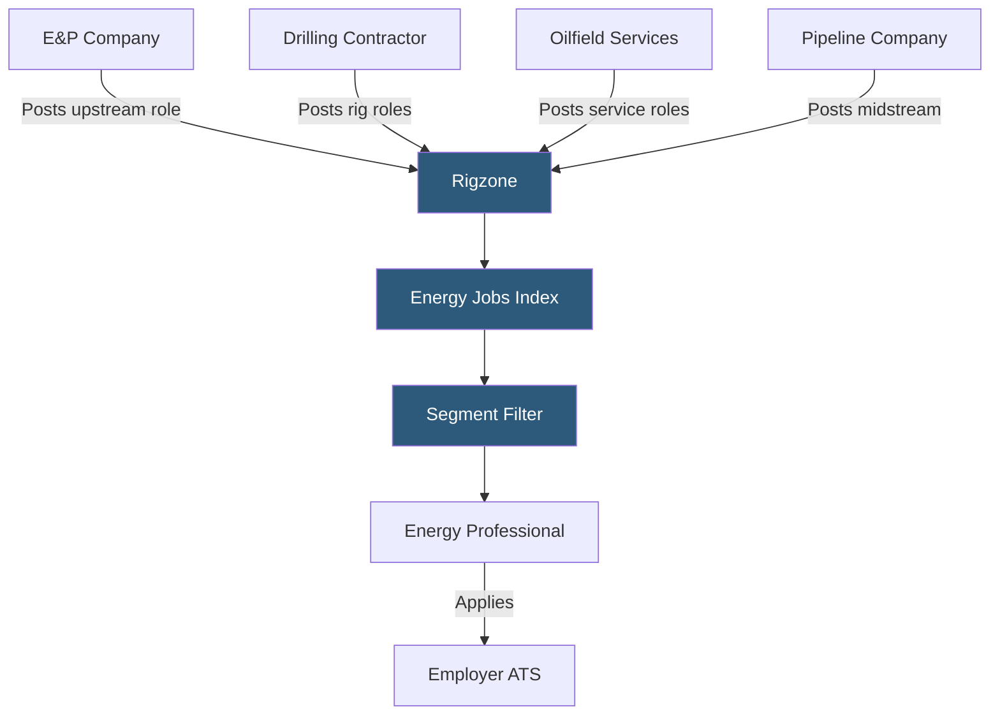

**Category:** Industry-Specific Job Boards
**Difficulty:** Intermediate
**Reading time:** 6 min read

---

Rigzone is the leading job board for the oil and gas, petrochemical, and energy sector, serving upstream, midstream, and downstream professionals including petroleum engineers, drilling engineers, geoscientists, and offshore platform workers worldwide.

- **Upstream / E&P** — exploration and production operations: drilling, well completion, and reservoir management
- **Midstream** — pipeline transportation, processing, and storage of hydrocarbons between production and refining
- **Downstream / Refining** — petroleum refining, chemical processing, and distribution operations
- **Offshore Platform** — fixed or floating marine structures for drilling and production, with specialized staffing requirements
- **Rotational Schedule** — common offshore work pattern (e.g., 28 days on / 28 days off) affecting compensation and lifestyle
- **Petroleum Engineer (PE)** — a licensed professional engineer specializing in hydrocarbon extraction optimization

Rigzone serves the entire oil and gas value chain, from wildcatting E&P companies searching for petroleum engineers and geologists to major integrated oil companies recruiting refinery process engineers and pipeline operators. The platform covers both onshore and offshore roles, with dedicated sections for drilling, completions, production operations, reservoir engineering, geoscience, and HSE (health, safety, environment).

Offshore staffing is a Rigzone specialty. Rotational offshore roles — platform operators, drillers, subsea engineers — have highly specific requirements (OPITO/BOSIET safety certification, offshore medical certificates, STCW credentials for vessel-based roles) that generalist boards cannot efficiently filter. Rigzone's candidate profiles include certification tracking for these credentials, allowing operators and drilling contractors to efficiently screen for safety-qualified candidates.

The energy sector experiences pronounced hiring cycles driven by commodity prices. When oil prices are elevated, E&P capital budgets expand and hiring surges; price downturns trigger rapid workforce reductions. Rigzone serves as a primary redeployment channel during downturns, when experienced petroleum engineers and drilling professionals displaced from one company need rapid placement elsewhere. The platform's global coverage is important — oil and gas employment is genuinely international, with candidates moving between North America, the North Sea, the Middle East, West Africa, and Southeast Asia based on project activity.

- E&P company staffing a new shale development program with completions engineers and production supervisors
- Drilling contractor recruiting a toolpusher for a deepwater drillship in the Gulf of Mexico
- Oilfield services company hiring field service technicians for a multi-well wireline logging campaign
- Midstream pipeline operator recruiting control room operators for a new NGL processing facility
- Petroleum engineer displaced during an oil price downturn searching for international opportunities

| Advantage | Disadvantage |
|-----------|--------------|
| Global energy sector coverage including offshore roles | Highly cyclical — activity collapses during price downturns |
| Offshore certification filtering is unique to specialized boards | Niche scope means no utility outside energy sector |
| International job coverage matches global industry footprint | Political/visa complexity in some key markets adds hiring friction |
| Energy cycle signals embedded in news content | Platform activity fluctuates with oil price — less reliable during downturns |

- [Energy Jobline Energy Sector](energy-jobline-energy-sector.md)
- [ConstructionJobs.com](constructionjobscom.md)
- [iHireEngineering Jobs](ihireengineering-jobs.md)

---
*Part of the [Industry-Specific Job Boards](index.md) category · [Back to Master Index](../../index.md)*
