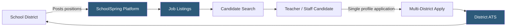

**Category:** Industry-Specific Job Boards
**Difficulty:** Beginner
**Reading time:** 5 min read

---

SchoolSpring is a K-12 education job board and applicant tracking platform used by school districts across the United States, supporting teacher recruitment, administrative hiring, and classified staff positions with a single-application workflow for multiple districts.

- **K-12 Hiring** — employment at elementary, middle, and high schools, including certified teaching and non-certified support staff roles
- **Certified vs. Classified** — certified roles require state teaching licensure; classified roles (aides, custodians, bus drivers) do not
- **District Recruitment Portal** — a branded application portal where job seekers apply to a specific school district
- **State Teaching License** — the credential required to teach in a public school, issued by each U.S. state individually
- **Single Application Profile** — SchoolSpring allows candidates to apply to multiple districts with one shared profile and credentials
- **Applicant Tracking** — the backend workflow districts use to manage applications, schedule interviews, and extend offers

SchoolSpring provides school districts with a dual-purpose tool: it functions as an outward-facing job board where candidates discover open positions, and an inward-facing applicant tracking system where district HR teams manage the hiring pipeline. Districts pay subscription fees based on enrollment size or feature tier, which funds both the platform and its public listing visibility.

The single-profile application system is a key differentiator. K-12 candidates — particularly early-career teachers — typically apply to dozens of districts simultaneously during the competitive spring hiring season. SchoolSpring allows them to build one comprehensive profile with resume, teaching portfolio, references, and license verification, then submit it to multiple district openings without re-entering data. This dramatically reduces friction in what would otherwise be an extremely repetitive application process.

Districts benefit from the standardized application format, which makes screening and comparison more efficient. HR teams can filter applicants by licensure area, experience level, and endorsements. The platform also handles reference collection, allowing candidates to provide reference contact information that triggers automated requests, centralizing reference management within the district's dashboard. SchoolSpring integrates with some state education employment systems, further extending reach.

- Newly licensed teacher applying to 40 districts across a state during the spring hiring season
- School district HR screening certified math teacher candidates with specific endorsements
- Retired teacher returning to substitute teaching searching for open substitute listings
- District administrator hiring a Director of Special Education with cross-district candidate sourcing
- School principal reviewing applications for a literacy interventionist position

| Advantage | Disadvantage |
|-----------|--------------|
| Single profile applies to multiple districts — reduces candidate friction | Primarily U.S.-focused and not applicable to private or charter schools uniformly |
| Integrated ATS removes need for separate HR software for smaller districts | Limited sophistication compared to enterprise ATS platforms |
| Reference collection automation saves district HR time | Platform familiarity varies; some districts use proprietary portals instead |
| Covers full range of K-12 roles from teachers to bus drivers | Less effective for urban districts with high brand recognition that attract direct applications |

- [Teachers-Teachers.com Education](teachers-teacherscom-education.md)
- [HigherEdJobs Academic Positions](higheredjobs-academic-positions.md)
- [Chronicle Vitae Faculty Jobs](chronicle-vitae-faculty-jobs.md)

---
*Part of the [Industry-Specific Job Boards](index.md) category · [Back to Master Index](../../index.md)*
