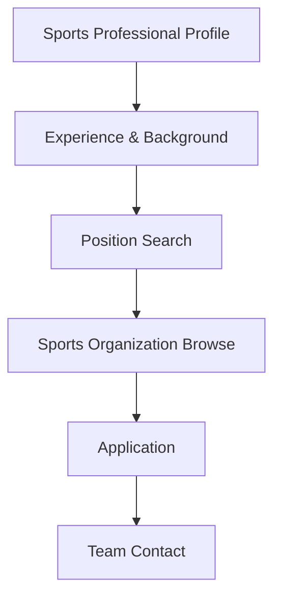

**Category:** Industry-Specific Job Boards
**Difficulty:** Intermediate
**Reading time:** 6 min read

---

Sports Jobs is a job board specializing in sports industry careers including athletic organizations, teams, venues, sporting goods companies, and sports management firms. It connects sports professionals with employment opportunities across the sports ecosystem.

- **Sports Industry Roles** — positions in team management, sports marketing, operations, and athlete representation
- **Professional and Amateur Sports** — opportunities with pro teams, college athletics, and amateur sports
- **Sports Business Functions** — careers in business operations, finance, legal, and corporate functions
- **Venue and Event Management** — positions in stadium operations and sports event management
- **Sports Merchandise and Retail** — opportunities with sporting goods companies and retailers

Sports professionals create profiles detailing experience in sports management, business operations, or specialized sports roles. Job search filters by organization type (professional team, college, venue, supplier), role type, and location. Job listings come from sports franchises, leagues, sporting goods companies, and sports management organizations. The platform provides comprehensive database of sports organizations enabling targeted research. Application processes typically go directly to team or organizational hiring departments. Sports salary benchmarks and compensation data support negotiation. Community features include networking with sports professionals and industry events. Sports news and market trends keep professionals current on industry developments.

- Team management and front office positions with professional sports franchises
- College athletics administration and coaching roles
- Sports marketing and sponsorship positions
- Venue and stadium operations management
- Athletic director and compliance officer positions

| Advantage | Disadvantage |
|-----------|--------------|
| Specialized platform attracts serious sports industry candidates | Limited job volume in competitive field |
| Direct access to team and organization listings | Geographic concentration in major sports markets |
| Sports-specific salary data supports negotiation | Requires sports industry background for many roles |
| Networking opportunities with sports professionals | Lower salaries than corporate roles in some positions |
| Industry news keeps professionals informed | Highly competitive field with many qualified candidates |

- [TeamWork Online Sports Careers](teamwork-online-sports-careers.md)
- [Sports Management Careers](../../index.md)
- [Sports Industry](../../index.md)

---
*Part of the [Industry-Specific Job Boards](index.md) category · [Back to Master Index](../../index.md)*
