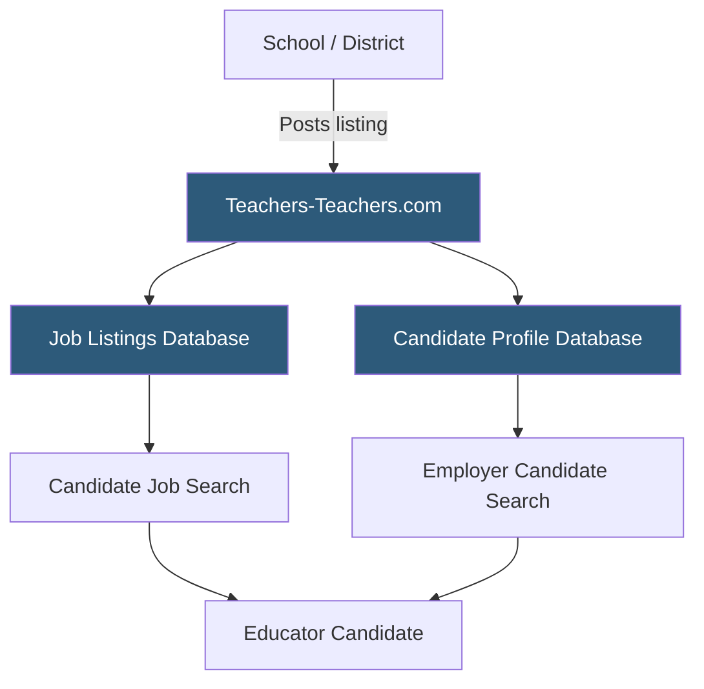

**Category:** Industry-Specific Job Boards
**Difficulty:** Beginner
**Reading time:** 5 min read

---

Teachers-Teachers.com is a K-12 education job board connecting certified teachers, paraprofessionals, and school administrators with public, private, and charter school employers across the United States.

- **Teaching Certificate** — state-issued credential authorizing teaching in a specific grade band or subject area
- **Paraprofessional** — classroom aide or instructional support staff working alongside certified teachers
- **Private School Employment** — positions at independent schools not bound by district HR systems
- **Charter School Hiring** — positions at publicly funded but independently operated schools with flexible hiring processes
- **Job Seeker Profile** — a public candidate record displaying credentials, experience, and subject area specializations
- **Employer Account** — a school or district account used to post listings and search candidate profiles

Teachers-Teachers.com operates as a two-sided marketplace with separate workflows for job seekers and employers. Job seekers create profiles highlighting their certifications, grade level experience, subject specializations, and geographic preferences. The profile system functions as a passive sourcing tool — schools and districts with employer accounts can search the candidate database proactively, reaching candidates who have not yet seen a specific listing.

The job listings side aggregates both direct employer postings and partner-sourced listings, giving candidates broader visibility. Public, private, and charter schools all use the platform, which is notable because most district-focused boards skew heavily toward traditional public school hiring. This breadth makes Teachers-Teachers.com a useful starting point for educators exploring different school governance models.

The search experience is straightforward: candidates filter by state, subject area, grade level, and school type. Because K-12 hiring has strong seasonal patterns (concentrated in January through April for the following school year), the platform experiences significant traffic spikes during these periods. Employers who post early in the hiring season benefit from less competition for candidate attention. The platform is particularly popular in smaller districts and rural areas where staffing challenges mean employers must cast a wider net to find qualified applicants.

- Elementary school teacher with dual certification searching for positions in multiple states
- Private school seeking a middle school science teacher outside the district system
- Charter school operator hiring a principal from candidates with charter-specific experience
- Special education teacher with behavior intervention credentials finding specialized openings
- International educator with U.S. certification searching for stateside positions

| Advantage | Disadvantage |
|-----------|--------------|
| Covers public, private, and charter schools in one place | Smaller listing volume than SchoolSpring in unionized districts |
| Employer candidate search supports proactive sourcing | Less integrated ATS functionality compared to SchoolSpring |
| Good reach in rural and small-district markets | Brand recognition lower among large urban districts |
| Free basic profile option for job seekers | Limited international school coverage |

- [SchoolSpring K-12 Education](schoolspring-k-12-education.md)
- [HigherEdJobs Academic Positions](higheredjobs-academic-positions.md)
- [iHireVeterinary Veterinary Jobs](ihireveterinary-veterinary-jobs.md)

---
*Part of the [Industry-Specific Job Boards](index.md) category · [Back to Master Index](../../index.md)*
