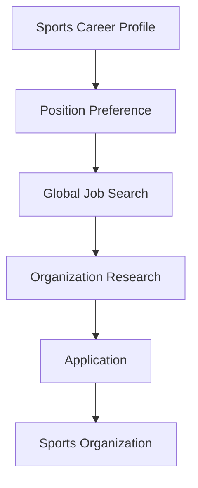

**Category:** Industry-Specific Job Boards
**Difficulty:** Intermediate
**Reading time:** 6 min read

---

TeamWork Online is a sports industry job board connecting sports professionals with teams, leagues, and sports organizations worldwide. It specializes in all levels of sports employment from amateur to professional.

- **Global Sports Network** — connects sports professionals with opportunities internationally
- **Multi-Sport Coverage** — positions across all sports including mainstream and niche sports
- **Coaching and Athletic Positions** — specialized roles for coaches and athletic professionals
- **Sports Administration** — front office, operations, and business management positions
- **Volunteer Opportunities** — resources for sports volunteers supporting teams and events

Sports professionals create profiles specifying sports interests, role preferences, and geographic preferences. The job board searches across professional leagues, college athletics, amateur sports, and international opportunities. Job listings come directly from teams, leagues, and sports organizations. The platform provides global coverage extending beyond North American sports. Application tracking tools manage candidate communication. Networking features connect sports professionals for mentoring and career guidance. Community forums discuss career opportunities and industry developments. Resource library provides guidance on sports career development and advancement strategies.

- Coaching positions across all sports and competitive levels
- Athletic administration and program management
- Sports operational and logistics positions
- International sports opportunities and exchanges
- Volunteer positions supporting sports teams and events

| Advantage | Disadvantage |
|-----------|--------------|
| Global reach expands sports employment opportunities | International positions may require relocation |
| Multi-sport coverage broader than single-sport platforms | Lower compensation in amateur and volunteer positions |
| Volunteer opportunities support entry into sports careers | Geographic variation in market conditions |
| Coaching and athletic role specialization | Language barriers for international positions |
| Community features support career development | Highly competitive field with many applicants |

- [Sports Jobs Sports Industry](sports-jobs-sports-industry.md)
- [International Sports Careers](../../index.md)
- [Sports Management Careers](../../index.md)

---
*Part of the [Industry-Specific Job Boards](index.md) category · [Back to Master Index](../../index.md)*
