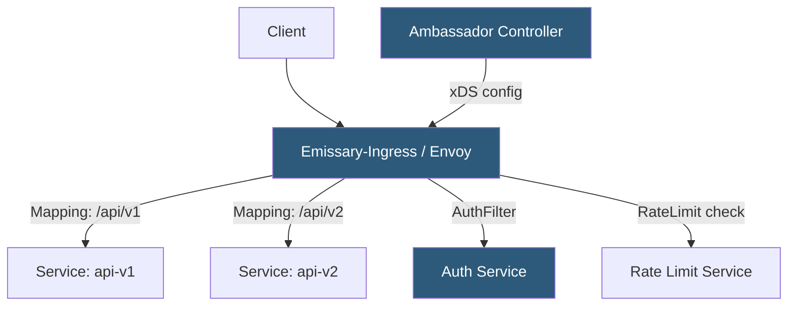

**Category:** Kubernetes Infrastructure
**Difficulty:** Intermediate
**Reading time:** 6 min read

---

Ambassador (now Emissary-Ingress) is a Kubernetes-native API gateway built on Envoy that uses Custom Resource Definitions to manage routing, authentication, rate limiting, and developer portals, making it a full API lifecycle management solution within the cluster.

- **Emissary-Ingress** — the open-source CNCF project formerly called Ambassador; uses Envoy as its data plane
- **Mapping** — the primary CRD that defines routing rules (hostname + prefix → Kubernetes service)
- **Module** — cluster-level Envoy settings (ambassador ID, diagnostics, TLS defaults)
- **TLSContext** — CRD for configuring TLS certificates and SNI settings
- **Rate limiting service** — external service integrated via RateLimitService CRD for per-user/per-API key limits
- **AuthService** — CRD that delegates authentication decisions to an external auth service (e.g., Keycloak, Dex)
- **DevPortal** — Ambassador Edge Stack feature that auto-generates developer-facing API documentation from OpenAPI specs

Emissary-Ingress runs two components: the **ambassador-agent** (controller) and the **ambassador** Envoy pod. The controller watches Mapping, TLSContext, Module, and other CRDs and translates them into Envoy xDS configuration. It pushes this configuration to Envoy via the ADS (Aggregated Discovery Service) endpoint, updating routing tables without process restarts.

**Mappings** are the core abstraction. A Mapping specifies a hostname, URL prefix, and target service, along with optional per-route configuration: timeouts, retries, CORS headers, header manipulation, load balancing policy, and filter chains. Multiple Mappings compose into a single Envoy virtual host configuration.

Ambassador's **filter chain** processes each request through a pipeline: rate limiting checks go to the RateLimitService (a gRPC service that returns allow/deny decisions), authentication checks go to the AuthService (also gRPC). These external services are stateless and horizontally scalable. The auth service can inject headers (JWT user info, RBAC roles) that backend services consume.

The **Ambassador Edge Stack** (commercial tier) adds a developer portal that reads OpenAPI annotations from Mapping objects and auto-generates interactive API documentation. It also provides OAuth/OIDC integration, traffic visibility dashboards, and edge policy management.

Because Envoy is the data plane, Ambassador benefits from Envoy's performance characteristics: non-blocking I/O, HTTP/2 and gRPC native support, circuit breaking, and outlier detection. These features are exposed through Mapping and Module CRDs.

- API-first teams wanting route management, auth, and rate limiting in one Kubernetes-native tool
- Developer portals generated automatically from service OpenAPI specs
- Multi-version API management where different path prefixes route to different service versions
- Edge authentication and token validation without sidecar injection

| Advantage | Disadvantage |
|-----------|--------------|
| Full API gateway feature set beyond basic Ingress routing | Controller watches many CRDs; large clusters with many Mappings can stress the controller |
| xDS-based dynamic config with no Envoy restarts | Edge Stack advanced features require commercial license |
| Envoy data plane provides HTTP/2, gRPC, and WebSocket natively | More complex to debug than NGINX; requires Envoy familiarity |
| External AuthService and RateLimitService are horizontally scalable | Mapping CRDs are Ambassador-specific; migrating requires rewriting routing config |

- [Kubernetes Ingress controllers](kubernetes-ingress-controllers.md)
- [Traefik proxy](traefik-proxy.md)
- [Service mesh architecture](service-mesh-architecture.md)

---
*Part of the [Kubernetes Infrastructure](index.md) category · [Back to Master Index](../../index.md)*
