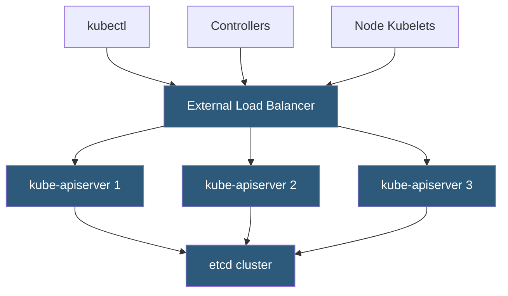

**Category:** Kubernetes Infrastructure
**Difficulty:** Advanced
**Reading time:** 6 min read

---

The Kubernetes API server is the single control-plane endpoint for all cluster operations, and scaling it correctly prevents bottlenecks in large or heavily automated clusters. Because it is stateless, it can be horizontally replicated behind a load balancer with no coordination overhead.

- **Horizontal scaling** — running multiple kube-apiserver replicas behind a load balancer
- **Request inflight limits** — `--max-requests-inflight` and `--max-mutating-requests-inflight` flags cap concurrent requests
- **Priority and Fairness (APF)** — the scheduling framework that queues and prioritizes API requests to prevent starvation
- **Watch cache** — in-memory cache of etcd objects that serves LIST and WATCH requests without hitting etcd directly
- **Aggregated API server** — an extension API server registered with the core API server to serve custom resource types
- **Audit logging** — recording of all API requests for security and compliance; impacts throughput at high volume
- **API server metrics** — `apiserver_request_total`, `apiserver_request_duration_seconds` expose performance signals

The API server is inherently stateless — all persistent state lives in etcd — so adding replicas requires only a load balancer update, not inter-server coordination. Each replica independently authenticates requests, validates object schemas, enforces admission policies, and reads/writes etcd.

The **watch cache** is the key optimization that makes multi-replica setups efficient. Instead of fanning out every LIST or WATCH request to etcd, each API server maintains an in-memory reflector of all object types. LIST requests are served from this cache, dramatically reducing etcd read pressure. The cache size is bounded by the `--watch-cache-sizes` flag per resource type.

**API Priority and Fairness** (enabled by default since 1.20) replaces the older static inflight limits with a multi-queue scheduler. Incoming requests are classified into FlowSchemas and assigned to PriorityLevelConfigurations. Critical system flows (node heartbeats, leader election) get reserved concurrency shares; lower-priority batch traffic is queued. This prevents a burst of controller or webhook traffic from starving kubelet health updates.

For very large clusters (5,000+ nodes), vertical sizing matters too. Each API server should have ample RAM to hold the watch cache and connection state. Profiling `apiserver_watch_cache_capacity_*` metrics reveals whether cache eviction is occurring. Audit log volume can become a significant I/O burden; directing audit output to a buffered asynchronous backend mitigates this.

- Scaling Kubernetes clusters past 1,000 nodes where single API server becomes a bottleneck
- Ensuring node heartbeat processing is not starved by CI/CD controllers using APF policies
- Blue-green upgrading the API server version by draining one replica at a time
- Multi-tenant clusters where different teams need rate-limited, isolated API access

| Advantage | Disadvantage |
|-----------|--------------|
| Stateless design makes horizontal scaling straightforward | Load balancer adds another component to configure and monitor |
| Watch cache reduces etcd read load significantly | Cache consumes significant RAM per replica for large clusters |
| APF prevents noisy-neighbor starvation of critical requests | APF configuration is complex; misconfigured FlowSchemas can throttle important traffic |
| Rolling upgrades achieve zero-downtime API version updates | Admission webhooks called on every write become latency bottlenecks under load |

- [Kubernetes control plane components](kubernetes-control-plane-components.md)
- [etcd cluster design](etcd-cluster-design.md)
- [RBAC (Role-Based Access Control)](rbac-role-based-access-control.md)

---
*Part of the [Kubernetes Infrastructure](index.md) category · [Back to Master Index](../../index.md)*
