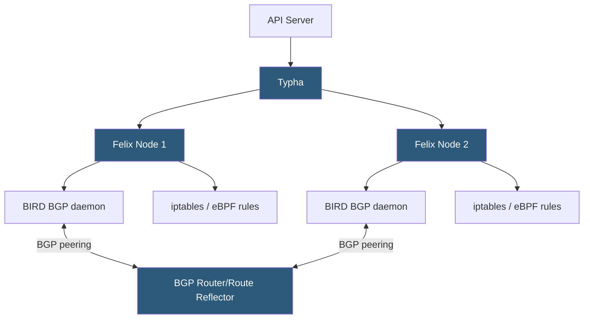

**Category:** Kubernetes Infrastructure
**Difficulty:** Intermediate
**Reading time:** 6 min read

---

Calico is a widely deployed Kubernetes networking plugin that provides pod networking via BGP-based routing or VXLAN overlay, combined with a rich NetworkPolicy engine enforced through iptables or eBPF. It is favored for production environments that require both high-performance networking and fine-grained security policy.

- **BGP routing** — Calico's native mode advertises pod CIDRs over BGP, delivering unencapsulated pod traffic
- **VXLAN mode** — Calico's overlay mode for environments where BGP is not feasible
- **Felix** — Calico's per-node agent that programs iptables/eBPF rules and manages routing table entries
- **BIRD** — BGP daemon embedded in Calico that manages BGP peering sessions
- **Typha** — scalability component that fans out API server watches to many Felix instances
- **GlobalNetworkPolicy** — Calico CRD that extends Kubernetes NetworkPolicy with cluster-wide rules and richer selectors
- **IPPool** — Calico resource that defines the IP address blocks available for pod allocation

In BGP mode, each Calico node runs a **BIRD** daemon that establishes BGP sessions with either a full mesh of peers (small clusters) or BGP route reflectors (large clusters). BIRD advertises the node's pod CIDR as a BGP route. All other nodes learn this route and program it in their kernel routing tables. When pod A on node 1 sends a packet to pod B on node 2, the packet is routed directly by the Linux kernel — no tunnel headers, no encapsulation.

**Felix** is the Calico dataplane agent running on every node. It watches Calico and Kubernetes resources via the Typha fan-out layer, translates NetworkPolicy into iptables rules or eBPF programs, and ensures the host routing table is correct. Felix operates asynchronously: it reconciles the desired policy state with the programmed state in a tight loop, similar to Kubernetes controllers.

**Typha** is a required component at scale. Without it, each Felix instance would open a watch connection directly to the API server. In a 1,000-node cluster, that creates 1,000 watches. Typha aggregates these into a small number of watches on behalf of all Felix instances, dramatically reducing API server load.

Calico's `GlobalNetworkPolicy` extends Kubernetes' namespaced `NetworkPolicy` with cluster-wide defaults, egress/ingress DNS-based policies, and rich selector expressions. This enables zero-trust network architecture where traffic is denied by default and allowed only for explicitly declared flows.

- High-performance bare-metal or on-prem Kubernetes clusters requiring native-speed pod networking
- Multi-tenant clusters needing strict network segmentation via GlobalNetworkPolicy
- Hybrid cloud environments where pod traffic must traverse BGP-capable network fabrics
- Audit and compliance scenarios requiring full network flow visibility via Calico's policy logs

| Advantage | Disadvantage |
|-----------|--------------|
| BGP native routing delivers near-wire performance with no encapsulation overhead | BGP mode requires peering with physical network infrastructure, adding complexity |
| Rich policy engine enables zero-trust network architecture | Policy rule count grows rapidly; large rulesets can slow iptables programming |
| Typha component enables scaling to 5,000+ node clusters | Typha adds another component to operate, monitor, and upgrade |
| Dual-stack IPv4/IPv6 support is mature | eBPF dataplane requires kernel 5.3+; older nodes must use iptables mode |

- [Container Network Interface (CNI)](container-network-interface-cni.md)
- [Cilium eBPF-based networking](cilium-ebpf-based-networking.md)
- [Kubernetes networking policies](kubernetes-networking-policies.md)

---
*Part of the [Kubernetes Infrastructure](index.md) category · [Back to Master Index](../../index.md)*
