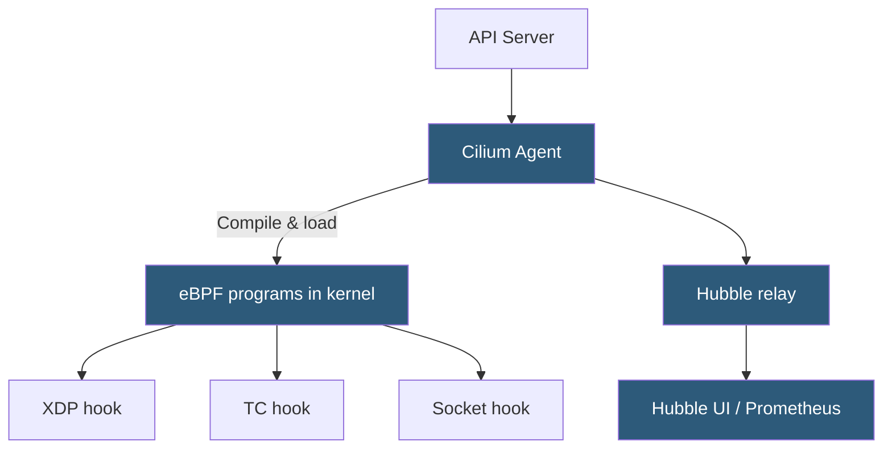

**Category:** Kubernetes Infrastructure
**Difficulty:** Advanced
**Reading time:** 7 min read

---

Cilium is a Kubernetes CNI plugin that leverages eBPF (extended Berkeley Packet Filter) to implement networking, load balancing, and security policy directly in the Linux kernel, achieving high performance and deep observability without iptables or kube-proxy.

- **eBPF** — a programmable kernel subsystem that allows running sandboxed programs in response to kernel events without modifying kernel source
- **XDP (eXpress Data Path)** — eBPF hook at the NIC driver level that processes packets before they enter the Linux networking stack
- **Cilium agent** — per-node daemon that compiles and loads eBPF programs into the kernel based on Kubernetes policy
- **Hubble** — Cilium's observability layer that uses eBPF to capture per-flow network telemetry
- **CiliumNetworkPolicy** — Cilium CRD extending Kubernetes NetworkPolicy with L7 protocol-aware rules (HTTP, DNS, Kafka)
- **BPF map** — in-kernel data structure (hash map, LRU, etc.) used by eBPF programs for fast state lookup
- **kube-proxy replacement** — Cilium mode that handles Service IP routing via eBPF, eliminating kube-proxy entirely

Cilium's dataplane runs entirely in the Linux kernel as eBPF programs. The **Cilium agent** on each node watches Kubernetes resources (Pods, Services, NetworkPolicies, CiliumNetworkPolicies) and dynamically compiles and loads the appropriate eBPF programs into the kernel's traffic-control hooks (TC hooks) attached to each pod's virtual ethernet interface.

Packet forwarding between pods on the same node is done via direct memory copies using eBPF socket-level redirection — bypassing the full IP networking stack. Cross-node traffic uses VXLAN, Geneve, or native routing (if BGP is available). In **kube-proxy replacement mode**, Cilium programs eBPF maps for Service IP-to-backend translation, handling load balancing at the socket layer for same-node traffic, achieving even lower latency than IPVS.

**L7 policy enforcement** is a unique Cilium capability. CiliumNetworkPolicy rules can inspect HTTP path, method, and headers, or Kafka topic/operation, and allow or deny at the application protocol level — all within the kernel's eBPF programs for eligible protocols, or via an injected L7 proxy (Envoy) for more complex cases.

**Hubble** uses eBPF to capture a flow record for every packet crossing pod interfaces. These flows are exported to Hubble relay aggregators and can be queried via CLI or visualized in the Hubble UI as a live service dependency map. This provides zero-instrumentation observability — applications need no sidecars or code changes.

- High-throughput clusters requiring the lowest possible networking overhead
- Zero-trust security posture with L7-aware NetworkPolicy (HTTP/DNS/Kafka rules)
- Service mesh observability without sidecar injection using Hubble
- Replacing kube-proxy to eliminate iptables rule scalability limits

| Advantage | Disadvantage |
|-----------|--------------|
| eBPF delivers kernel-bypass-class performance with no encapsulation overhead | Requires Linux kernel 5.4+ (some features need 5.10+); older OSes unsupported |
| L7 protocol awareness goes beyond what Kubernetes NetworkPolicy supports | Debugging eBPF programs requires specialized skills and tooling |
| Hubble provides deep observability without sidecars | Large deployments require careful Hubble relay sizing; flow data volume is high |
| kube-proxy replacement eliminates iptables scaling bottleneck | Single CNI replacement; migrating an existing cluster from another CNI is disruptive |

- [Container Network Interface (CNI)](container-network-interface-cni.md)
- [Calico networking](calico-networking.md)
- [Kubernetes networking policies](kubernetes-networking-policies.md)

---
*Part of the [Kubernetes Infrastructure](index.md) category · [Back to Master Index](../../index.md)*
