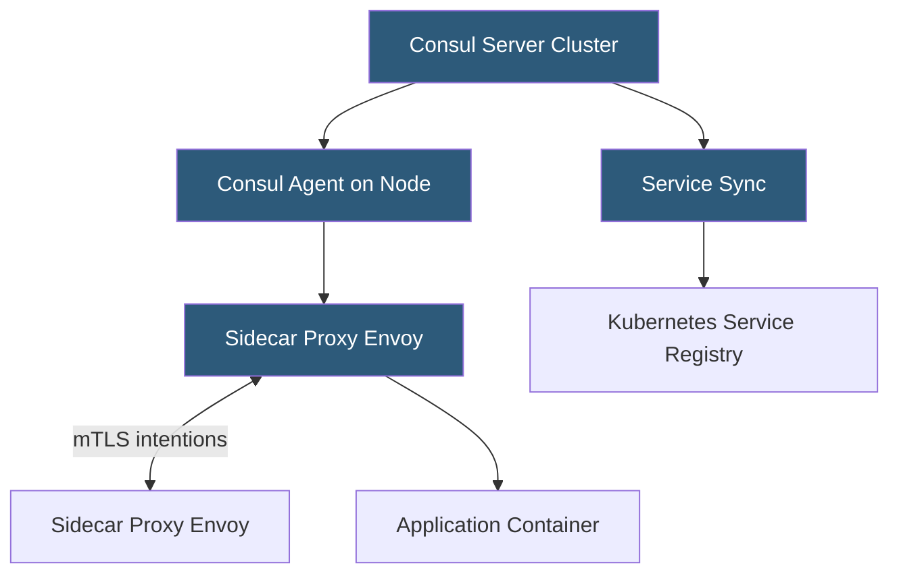

**Category:** Kubernetes Infrastructure
**Difficulty:** Intermediate
**Reading time:** 6 min read

---

Consul Connect is HashiCorp's service mesh solution that extends Consul's service discovery with mTLS sidecar proxying, intentions-based access control, and multi-platform support spanning Kubernetes, VMs, and bare metal.

- **Consul server** — the centralized service registry and KV store that proxies consult for service discovery
- **Connect sidecar** — Envoy proxy injected by Consul injector or configured manually for mTLS and policy
- **Service intentions** — Consul's ACL model for service-to-service allow/deny decisions
- **Transparent proxy** — mode that redirects all pod traffic through the Envoy sidecar automatically
- **Consul on Kubernetes (consul-k8s)** — Helm-based installer and controller for Kubernetes integration
- **Service sync** — bidirectional synchronization between Kubernetes Services and Consul service catalog
- **HCP Consul** — HashiCorp Cloud Platform managed Consul control plane

Consul Connect integrates with Kubernetes through the `consul-k8s` Helm chart, which deploys Consul servers (or connects to HCP Consul), installs a MutatingWebhook for sidecar injection, and runs service sync controllers. When a pod is created in a namespace with injection enabled, the webhook adds an Envoy sidecar container and an init container that configures iptables rules for traffic redirection.

Each Consul agent on the node registers the pod as a service in the Consul catalog and obtains a short-lived TLS certificate from Consul's built-in CA (using the Connect CA). The Envoy sidecar uses these credentials to establish mTLS with peer sidecars.

**Service intentions** are the primary security primitive. An intention specifies whether traffic is allowed or denied between a source service and a destination service, based on Consul service identities. Intentions are evaluated by the destination-side sidecar before accepting any connection. This complements Kubernetes NetworkPolicy but operates at the application-identity layer rather than the IP layer.

Consul's multi-platform design is its differentiator. A Kubernetes-hosted microservice can communicate securely with a legacy Java application running on a VM, both registered in the same Consul catalog and protected by intentions and mTLS — without any requirement that the VM run Kubernetes. This makes Consul Connect especially attractive during cloud migration phases when workloads span platforms.

- Hybrid Kubernetes + VM environments requiring unified service mesh and service discovery
- Organizations already using Consul for KV store, service discovery, or ACLs
- Multi-cluster service meshes where Consul federation links multiple Kubernetes clusters
- Migration scenarios where VMs and containers must communicate securely

| Advantage | Disadvantage |
|-----------|--------------|
| Multi-platform support spans Kubernetes, VMs, and bare metal in one mesh | Consul server cluster is a critical dependency; its availability affects all service discovery |
| Intentions model is simpler and more intuitive than Istio AuthorizationPolicy | Feature parity with Istio on traffic management (canary, fault injection) requires more configuration |
| HCP Consul offloads server operations | HCP Consul adds cost; self-managed server clusters require operational expertise |
| Bidirectional service sync bridges Kubernetes and non-Kubernetes environments | Consul catalog can become inconsistent with Kubernetes state during split-brain scenarios |

- [Service mesh architecture](service-mesh-architecture.md)
- [Istio service mesh](istio-service-mesh.md)
- [Linkerd lightweight service mesh](linkerd-lightweight-service-mesh.md)

---
*Part of the [Kubernetes Infrastructure](index.md) category · [Back to Master Index](../../index.md)*
