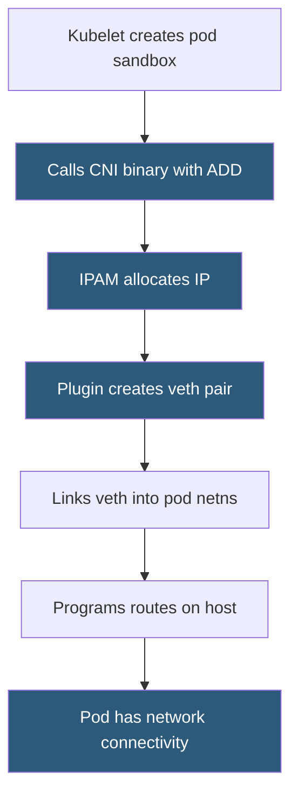

**Category:** Kubernetes Infrastructure
**Difficulty:** Intermediate
**Reading time:** 6 min read

---

The Container Network Interface is a specification and library that defines how container runtimes invoke network plugins to configure pod networking. It decouples Kubernetes from any specific networking implementation, allowing operators to choose from plugins with different features, performance profiles, and security models.

- **CNI specification** — defines the JSON-based configuration format and the `ADD`, `DEL`, `CHECK`, `GC` plugin operations
- **Pod CIDR** — the IP address range from which pod IPs are allocated per node
- **Overlay network** — encapsulates pod traffic inside host-network packets (VXLAN, Geneve) to traverse infrastructure without routing changes
- **Underlay / BGP routing** — advertises pod CIDRs directly via BGP, avoiding encapsulation overhead
- **IPAM plugin** — IP Address Management plugin responsible for allocating and releasing pod IP addresses
- **Chained plugins** — multiple CNI plugins called in sequence (e.g., main plugin + bandwidth plugin + portmap plugin)
- **Node-local pod CIDR** — each node gets a dedicated subnet slice, enabling O(1) routing lookups per destination node

When the kubelet creates a pod sandbox (network namespace), it calls the configured CNI plugin binary with the `ADD` command and a JSON config describing the desired network. The CNI plugin must complete four tasks: allocate an IP address (via an IPAM sub-plugin), create a virtual ethernet pair (`veth`), place one end inside the pod's network namespace, and program the host-side routing so other pods can reach the new IP.

Overlay plugins like **Flannel** (VXLAN mode) and **Weave Net** encapsulate pod-to-pod traffic in UDP or VXLAN frames. This works on any L3 network without requiring BGP peering with the underlying infrastructure. The encapsulation overhead is typically 50–100 bytes per packet and adds measurable CPU cost on high-throughput workloads.

BGP-based plugins like **Calico** (native mode) advertise pod CIDRs to the physical network using the BGP protocol. Pod packets travel as normal IP packets, eliminating encapsulation. This delivers near-wire-speed performance but requires a BGP-capable network fabric.

**Cilium** takes a different approach, replacing iptables and CNI data-plane rules with eBPF programs loaded directly into the Linux kernel. eBPF programs run at packet-processing speed, enforce network policies with microsecond granularity, and expose rich observability data without kernel modifications.

- Selecting a CNI plugin matching organizational constraints (cloud provider managed, self-managed BGP, eBPF performance)
- Enforcing Kubernetes NetworkPolicy with a policy-capable CNI like Calico or Cilium
- Troubleshooting pod networking failures by tracing CNI logs and IPAM allocation state
- Migrating between CNI plugins during cluster upgrades with minimal downtime

| Advantage | Disadvantage |
|-----------|--------------|
| Plugin abstraction allows selecting the best fit for each environment | Changing CNI plugins requires cluster-wide network restart — high operational risk |
| Overlay networking works on any cloud without infrastructure changes | Encapsulation adds latency and CPU overhead versus native routing |
| eBPF-based plugins deliver kernel-bypass performance and observability | eBPF requires Linux kernel 4.19+ with specific kernel configs enabled |
| Chained plugins compose bandwidth limiting, port mapping, and main networking | Debugging multi-plugin chains requires understanding each plugin's configuration |

- [Calico networking](calico-networking.md)
- [Cilium eBPF-based networking](cilium-ebpf-based-networking.md)
- [Flannel overlay network](flannel-overlay-network.md)

---
*Part of the [Kubernetes Infrastructure](index.md) category · [Back to Master Index](../../index.md)*
